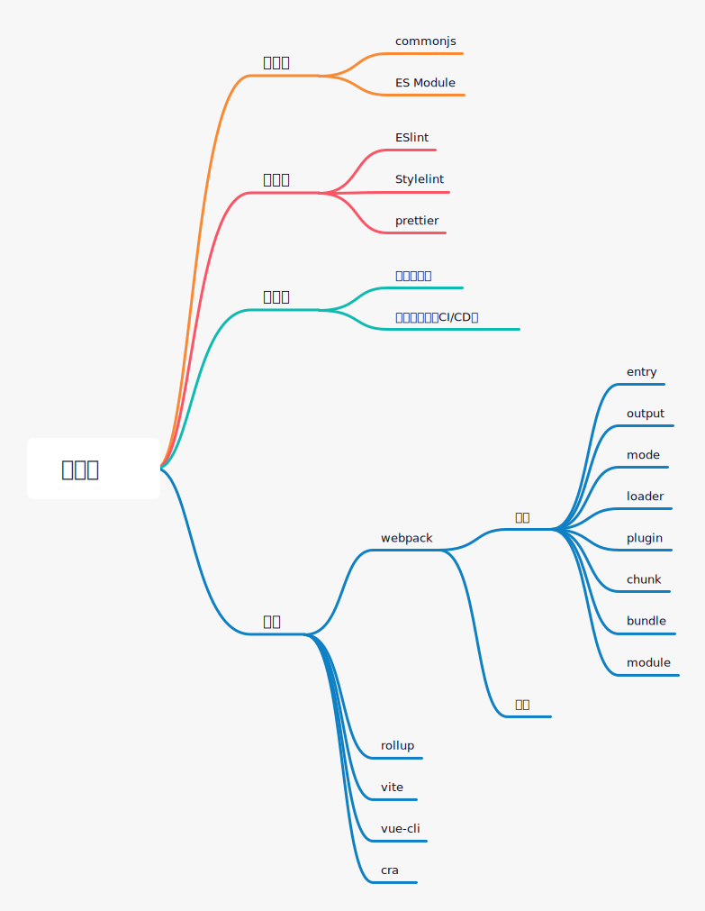

# 知识体系

[链接](https://www.processon.com/mindmap/60e66dc01efad457654f9198)

- javascript
    * 运行时
        + 执行过程
            * [执行上下文](./js/execution_context.md)
            * [作用域](./js/scope.md)
            * [this绑定](./js/this.md)
            * [变量提升](./js/hoisting.md)
            * [IIFE](./js/IIFE.md)
            * [闭包](./js/closure.md)
            * [原型链和继承](./js/prototype.md)
            * [事件循环](./js/event_loop.md)
            * [浮点数精度](./js/float.md)
            * [类型转换](./js/conversion.md)
            * [规范中的隐式转换](./js/conversion_specification.md)
            * [严格模式](./js/strict_mode.md)
            * [事件](./js/event.md)
            * [promise]
    * 使用
        + [去抖和节流](./js/debounce_throttle.md)
        + [深浅拷贝](./js/clone.md)
        + [柯里化](./js/curry.md)
        + [递归](./js/recursion.md)
        + [类型判断](./js/type_check.md)
        + [模块化](./js/module.md)
        + [遍历对象的属性](./js/get_object_key.md)
        + [数组方法]
        + [字符串方法]
        + [对象方法]
        + [手写题](./js/achieve_byself.md)
        + [排序算法](./js/sort.md)
        + [查找算法](./js/search.md)
    * 设计模式

[链接](https://www.processon.com/mindmap/610e0572f346fb2a2e982bcc)

- css & html
    * html
        + 元素
            * [src和href](./html_css/src_href.md)
            * [property和attribute](./html_css/property_attribute.md)
            * [script](./html_css/html_script.md)
            * [link](./html_css/html_link.md)
            * [form](./html_css/html_form.md)
            * [preload](./html_css/preload.md)
            * [获取元素](./html_css/get_element.md)
            * [获取元素尺寸和位置](./html_css/get_element_size.md)
            * [处理元素class](./html_css/handle_className.md)
    * css
        + 语言
            * [@rule](./html_css/html_at_rule.md)
            * [选择器](./html_css/selectors.md)
            * [伪类伪元素](./html_css/pseudo.md)
            * [值与单位](./html_css/values_and_units.md)
        + 布局
            * [block和inline](./html_css/block_inline.md)
            * [盒模型](./html_css/box_model.md)
            * [视觉格式模型](./html_css/visual_formatting_model.md)
            * [书写模式](./html_css/writing_mode.md)
            * [float和BFC](./html_css/float_BFC.md)
            * [position](./html_css/position.md)
            * [display](./html_css/display.md)
            * [flex](./html_css/flex.md)
            * [居中问题](./html_css/in_the_middle.md)
            * [常见布局](./html_css/familiar_layout.md)
        + 绘制
            * [文字相关]
            * [动画]
        + 应用
            * [移动端适配](./html_css/mobile.md)

[链接](https://www.processon.com/mindmap/6108212e1e0853337b1678d6)

- 浏览器
    * webAPI
        + [定时器](./browser/timer.md)
        + [XMLHttpRequest](./browser/XMLHttpRequest.md)
        + [fetch](./browser/fetch.md)
        + [requestAnimationFrame](./browser/requestAnimationFrame.md)
        + [history](./browser/history.md)
        + [Image](./browser/image.md)
        + [serviceWorker]
    * js数据存储
        + [垃圾回收](./browser/garbage_collection.md)
        + [js如何执行](./browser/js_how_to_run.md)
    * 浏览器数据存储
        + [cookie和localStorage和sessionStorage](./browser/cookie_storage.md)
        + [indexedDB]
    * 浏览器安全
        + [安全概述](./browser/security.md)
        + [csp](./browser/csp.md)
        + [csrf](./browser/csrf.md)
    * 页面
        * [从url到页面发生了什么](./browser/url_to_page.md)
        + [渲染流程](./browser/browser_render_process.md )
        + [重绘和重排](./browser/repaint_reflow.md)

[链接](https://www.processon.com/mindmap/60eba6ac1e08530964183b2b)

- http
    * 使用
        + 报文
            * [起始行](./http/first_line.md)
            * [头部](./http/headers.md)
            * [主体](./http/body.md)
        + [缓存](./http/cache.md)
        + [跨域](./http/cross-domain.md)
    * 历史
        + [http 历史](./http/history.md)
        + [三次握手 四次挥手](./http/three_way_handshake.md)

[链接](https://www.processon.com/mindmap/60eedb4d1e085306ea6da81b)

- vue
    * 使用
        + [组件通信](./vue/component_communicate.md)
        + [导航守卫](./vue/navigation_guards.md)
        + [性能优化](./vue/performance_optimizing.md)
        + [keep-alive应用](./vue/keep_alive_apply.md)
        + [mixin和extend和use](./vue/mixin_extend_use.md)
        + [slot应用](./vue/slot_apply.md)
        + [修饰符](./vue/modifiers.md)
    * 原理
        + [mvvm](./vue/mvvm.md)
        + [初始化](./vue/init.md)
        + [响应式](./vue/reactivity.md)
        + [组件化](./vue/component.md)
        + [编译器](./vue/compiler.md)
        + [diff](./vue/diff.md)
        + [computed和watch]
        + [v-for和v-if](./vue/vfor_vif.md)
        + [data](./vue/data.md)
        + [ref](./vue/ref.md)
        + [keep-alive](./vue/keep_alive.md)
        + [slot](./vue/slot.md)
        + [v-model](./vue/vmodel.md)

[链接](https://www.processon.com/mindmap/6113c9f5e401fd5eeb87a4b3)

- nodejs
    * 基础
        + [path]
        + [fs]
        + [Buffer]
        + [stream]
        + [http]

- 工程化
    * webpack
        + 使用
            * [webpack基础](./webpack/webpack_base.md)
            * [webpack优化](./webpack/webpack_optimise.md)
            * [browserslist]
            * [babel-loader]
            * [style-loader和css-loader和postcss-loader]
        + 原理
            * [source-map](./webpack/source-map.md)
            * [HMR](./webpack/hmr.md)

- 前端实践
    * [ESLint代码规范](./frontend_practice/eslint.md)
    * [stylelint代码规范](./frontend_practice/stylelint.md)
    * [prettier代码规范](./frontend_practice/prettier.md)
    * [webpack-bundle-analyzer](./frontend_practice/webpack_bundle_analyzer.md)