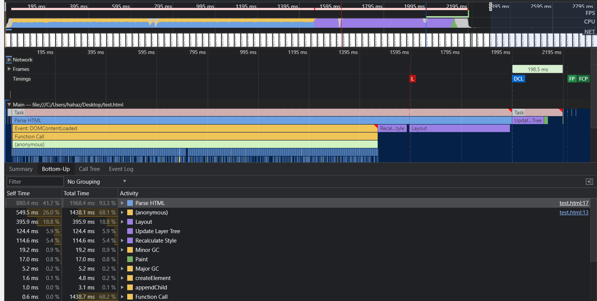
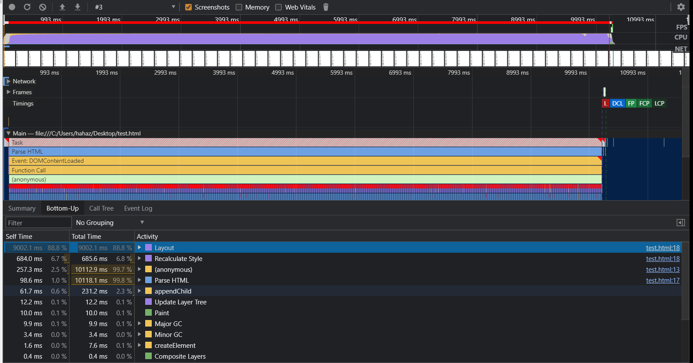

# 重排和重绘

## reflow（重排，或回流）

更新了元素的几何属性，就会发生 reflow（重排，或回流）。

通过 JavaScript 或者 CSS 修改元素的几何位置属性，例如改变元素的宽度、高度等，那么浏览器会触发重新布局，解析之后的一系列子阶段，这个过程就叫重排。无疑，重排需要更新完整的渲染流水线，所以开销也是最大的。

reflow 需要重新走的流程：

1. 构建 DOM 树
2. 样式计算
3. 布局阶段
4. 分层
5. 绘制
6. 分块
7. 栅格化
8. 合成

## repaint （重绘）

修改了元素的背景颜色，那么布局阶段将不会被执行，因为并没有引起几何位置的变换，所以就直接进入了绘制阶段，然后执行之后的一系列子阶段，这个过程就叫重绘。相较于重排操作，重绘省去了布局和分层阶段，所以执行效率会比重排操作要高一些。

repaint 需要重新走的流程：

2. 样式计算
5. 绘制
6. 分块
7. 栅格化
8. 合成

## 合成

CSS 的 transform 来实现动画效果，这可以避开重排和重绘阶段，直接在非主线程上执行合成动画操作。这样的效率是最高的，因为是在非主线程上合成，并没有占用主线程的资源，另外也避开了布局和绘制两个子阶段，所以相对于重绘和重排，合成能大大提升绘制效率。

合成 需要重新走的流程：

2. 样式计算
6. 分块
7. 栅格化
8. 合成


## 优化

### 哪些情况会发生重排？

* 加或者删除可见的DOM元素；
* 元素尺寸改变，例如边距、填充、边框、宽度和高度、字体大小
* 元素内容改变
* 浏览器窗口尺寸改变，resize事件发生时
* 查询某些属性或调用某些计算方法：offsetWidth、offsetHeight 等

可以去 [csstriggers](https://csstriggers.com/) 网站查看哪些 css 样式的修改会重新触发 layout paint composite。

### 如何降低重排的用时？

* 减少不必要的 DOM 深度。在 DOM 树中的一个级别进行更改可能会致使该树的所有级别（上至根节点，下至所修改节点的子级）都随之变化。这会导致花费更多的时间来执行重排。
* 尽可能减少 CSS 规则的数量，并移除未使用的 CSS 规则。
* 如果您想进行复杂的渲染更改（例如动画），请在流程外执行此操作。您可以使用 position-absolute 或 position-fixed 来实现此目的。
* 避免使用不必要且复杂的 CSS 选择器（尤其是后代选择器），因为此类选择器需要耗用更多的 CPU 处理能力来执行选择器匹配。

* 样式集中改变
    ```js
        // bad
        var left = 10;
        var top = 10;
        el.style.left = left + "px";
        el.style.top = top + "px";

        // better 
        el.style.cssText += "; left: " + left + "px; top: " + top + "px;";

        // better
        el.className += " className";
    ```
* 分离读写操作
    ```js
        // bad 强制刷新 触发四次重排+重绘
        div.style.left = div.offsetLeft + 1 + 'px';
        div.style.top = div.offsetTop + 1 + 'px';
        div.style.right = div.offsetRight + 1 + 'px';
        div.style.bottom = div.offsetBottom + 1 + 'px';


        // good 缓存布局信息 相当于读写分离 触发一次重排+重绘
        var curLeft = div.offsetLeft;
        var curTop = div.offsetTop;
        var curRight = div.offsetRight;
        var curBottom = div.offsetBottom;

        div.style.left = curLeft + 1 + 'px';
        div.style.top = curTop + 1 + 'px';
        div.style.right = curRight + 1 + 'px';
        div.style.bottom = curBottom + 1 + 'px';
    ```
* 通过使用 DocumentFragment 创建一个 dom 碎片，在它上面批量操作 dom，操作完成之后，再添加到文档中，这样只会触发一次重排。
* position 属性为 absolute 或 fixed 的元素，重排开销比较小，不用考虑它对其他元素的影响
* 使用 transform 动画。可以避开重排和重绘阶段，直接在非主线程上执行合成动画操作。

### 浏览器本身对重排也做了优化

```js
    document.addEventListener('DOMContentLoaded', function () {
        var date = new Date();
        for (var i = 0; i < 70000; i++) {
            var tmpNode = document.createElement("div");
            tmpNode.innerHTML = "test" + i;
            document.body.appendChild(tmpNode);
        }
        console.log(new Date() - date);
    });
```
这是这段代码运行的 performance 记录截图：



可以看到大部分时间花在了 parse HTML 上，不停地解析 html 去生成新的 DOM 树。但是最后只在最后一个 Task 里 paint 了一次。

有一些值的计算会强制触发 reflow：

* offsetTop/Left/Width/Height
* scrollTop/Left/Width/Height
* clientTop/Left/Width/Height
* getComputedStyle(), or currentStyle in IE

例如下面的代码渲染页面就会非常缓慢：

```js
document.addEventListener('DOMContentLoaded', function () {
    var date = new Date();
    for (var i = 0; i < 7000; i++) {
        var tmpNode = document.createElement("div");
        tmpNode.innerHTML = "test" + i;
        document.body.offsetHeight; // 获取body的真实值
        document.body.appendChild(tmpNode);
    }
    console.log("speed time", new Date() - date);
});
```

这是这段代码运行的 performance 记录截图：



可以看到因为去获取 offsetHeight 值，造成浏览器不停地执行布局阶段的计算（layout，创建布局树，计算布局树中节点的坐标），layout 操作耗费了 9 秒多的时间。


通过上面两个例子可以看到，浏览器将 parse HTML 和 Layout 还有 Recalculate Style 放在了同一个 Task 中，等到这三个操作都结束了，才会去 Update Layer Tree ，然后 paint。

也就是说将 构建 DOM 树，样式计算，创建布局树 这三个操作放在一起，因为它们比较复杂，耗时长，等它们对应的 Task 执行结束后，再去分层（创建图层树）和绘制。