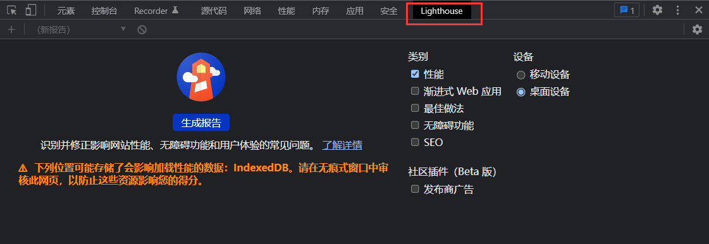
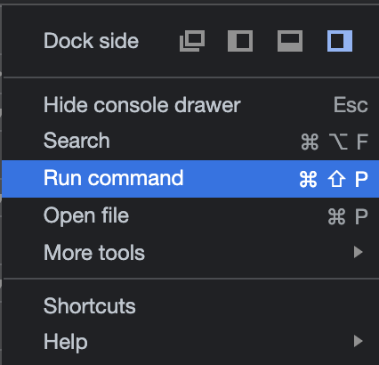
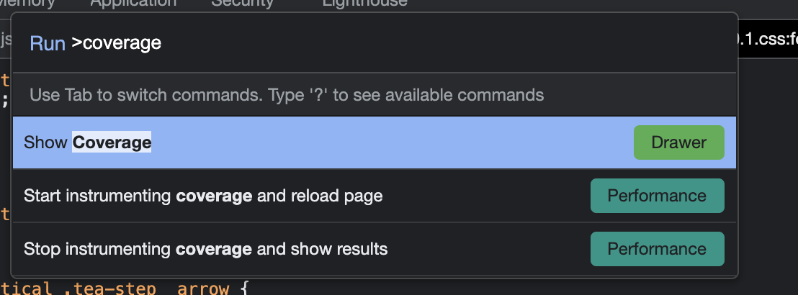
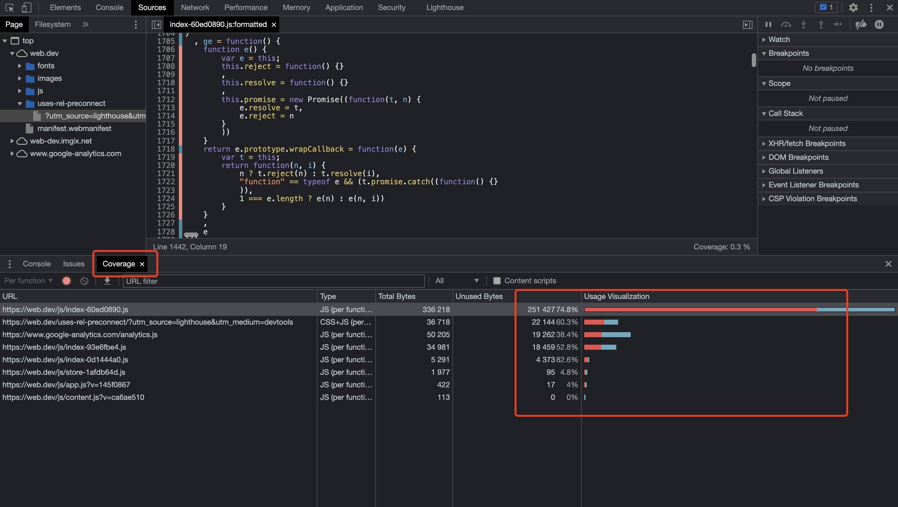
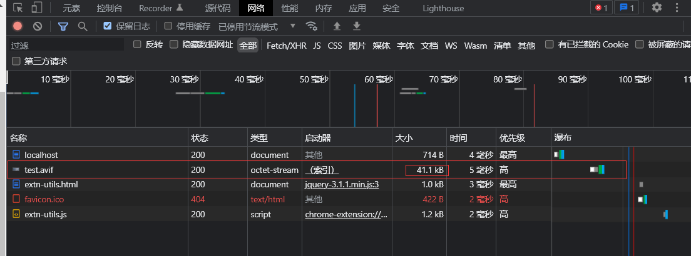
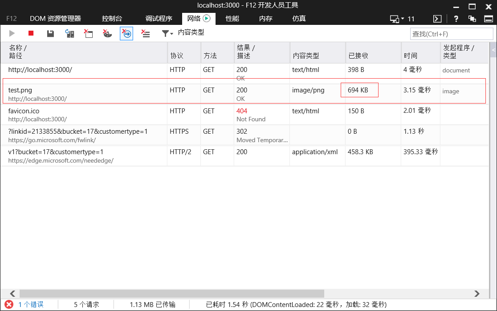

# 使用 lighthouse 分析网站性能

## 安装和使用

```bash
npm install -g lighthouse

lighthouse https://meeting.tencent.com/ --locale zh --quiet --chrome-flags="--headless" --only-categories=performance
```
这样运行后直接会在当前目录下生成 lighthouse 的报告，是一个 html 文件。

除了这样还可以直接使用 chrome 开发者工具自带的 lighthouse。




## 指标

使用 lighthouse 后有这样几个指标：

* FCP（First Contentful Paint）首次内容绘制。从进入页面到首次有 DOM 内容绘制所用的时间。这里的 DOM 内容指的是文本、图片、非空的 canvas 或者 SVG。
* LCP（Largest Contentful Paint）最大内容绘制。从页面开始加载到视窗内最大内容绘制的所需时间，这里的内容指文本、图片、视频、非空的 canvas 或者 SVG 等。
* CLS（Cumulative Layout Shift）累计布局位移。比较单个元素在帧与帧之间的位置偏移来计算。
* TTI（Time To Interactive）页面可交互的时间。这个时间的确定需要同时满足以下几个条件：
  * 页面开始绘制内容，即 FCP 指标开始之后
  * 用户的交互可以及时响应：
  * 页面中大部分可见的元素已经注册了对应的监听事件（通常在 DOMContentLoaded 事件之后）
  * 在 TTI 之后持续 5 秒的时间内无长任务执行（没有超过 50 ms 的执行任务 & 没有超过 2 个 GET 请求）
* TBT（Total Blocking Time）阻塞总时间，测量页面被阻止响应用户输入（例如鼠标点击、屏幕点击或按下键盘）的总时间。总和是首次内容绘制和互动时间之间所有长时间任务的阻塞部分之和。任何执行时间超过 50 毫秒的任务都是长任务。50 毫秒后的时间量是阻塞部分。例如，如果 Lighthouse 检测到一个 70 毫秒长的任务，则阻塞部分将为 20 毫秒。

## 分析
### 用 Chrome Devtool Coverage 分析无用的代码

可以使用 Chrome Devtool Coverage 面板来查看 js 文件中加载了哪些不必要的资源。打开 Coverage 面板的步骤：

* 点击 Devtool 右上角的 Customize and control Devtools 按钮（就是三个竖直排列的小圆点），打开下拉选项框，在其中选择 `Run command`



* 然后在弹出的输入命令的面板中输入 coverage，这时候面板自动联想出打开 Coverage 面板的命令，点击即可打开 Coverage 面板。



* 然后我们刷新一下页面，就可以看到 Coverage 中显示各种加载的文件的分析结果了。其中红色代表没有被执行的代码，也就是无用代码，蓝色代表执行过的也就是有用的代码。



通过 Coverage 面板一目了然，哪些文件里无用代码过多，就可以想办法去做提取或者拆分。

### 用 webpack-bundle-analyzer 插件分析打包文件大小和组成部分

webpack-bundle-analyzer 插件可以将 webpack 编译输出的文件视觉化成一个可以交互和缩放的树状图。用来分析打包后的文件大小和包含的模块，然后可以帮助你做进一步优化。

```js
yarn add -D webpack-bundle-analyzer
```

使用的时候在 webpack 配置中添加到 plugins 里就可以了

```js
const BundleAnalyzerPlugin = require('webpack-bundle-analyzer').BundleAnalyzerPlugin;

module.exports = {
  plugins: [
    new BundleAnalyzerPlugin()
  ]
}
```


## 优化 js

下面是一些常见优化手段：

* 合理的加载顺序/策略（延迟加载/预先加载）
* 压缩优化资源的体积
* 代码分割 & 公共提取 & 按需加载

### optimization.splitChunks

optimization.splitChunks 可以提取那些被多个 chunk 引用的 module 为新的 chunk，以避免重复引用。下面举几个例子：

* Vendors

```bash
chunk-a: react, react-dom, some components
chunk-b: react, react-dom, some other components
chunk-c: angular, some components
chunk-d: angular, some other components
```

webpack 会自动创建两个 vendors chunks：

```bash
vendors~chunk-a~chunk-b: react, react-dom
vendors~chunk-c~chunk-d: angular
chunk-a to chunk-d: Only the components
```

* Multiple shared modules

```bash
chunk-a: react, react-dom, some components, some shared react components
chunk-b: react, react-dom, angular, some other components
chunk-c: react, react-dom, angular, some components, some shared react components, some shared angular components
chunk-d: angular, some other components, some shared angular components
```

webpack 会自动创建两个 vendors chunks 和两个 commons chunks

```bash
vendors~chunk-a~chunk-b~chunk-c: react, react-dom
vendors~chunk-b~chunk-c~chunk-d: angular
commons~chunk-a~chunk-c: some shared react components
commons~chunk-c~chunk-d: some shared angular components
chunk-a to chunk-d: Only the components
```

下面是 optimization.splitChunks 写法：

```js
module.exports = {
  //...
  optimization: {
    splitChunks: {
      chunks: 'async', // 将选择哪些 chunk 进行优化
      minSize: 20000, // 生成 chunk 的最小体积（以 bytes 为单位）
      minRemainingSize: 0, // webpack 5.x 通过确保拆分后剩余的最小 chunk 体积超过限制来避免大小为零的模块
      minChunks: 1, // 拆分前被其他 chunks 引用的最小数量
      maxAsyncRequests: 30, //按需加载时的最大并行请求数。
      maxInitialRequests: 30, // 入口点的最大并行请求数。
      enforceSizeThreshold: 50000,
      cacheGroups: { // 缓存组
        defaultVendors: { // 用于筛选 node_modules 下的模块
          test: /[\\/]node_modules[\\/]/,
          priority: -10,
          reuseExistingChunk: true,
        },
        default: { // 默认缓存组
          minChunks: 2,
          priority: -20,
          reuseExistingChunk: true,
        },
      },
    },
  },
};

```
### 组件懒加载

```js
import React, { Suspense } from 'react';

const OtherComponent = React.lazy(() => import('./OtherComponent'));
const AnotherComponent = React.lazy(() => import('./AnotherComponent'));

function MyComponent() {
  return (
    <div>
      <Suspense fallback={<div>Loading...</div>}>
        <section>
          <OtherComponent />
          <AnotherComponent />
        </section>
      </Suspense>
    </div>
  );
}
```
这样组件首次渲染时，会自动导入包含该组件的包

### DCE

摇树优化（Tree-Shaking）是用于消除死代码（Dead-Code Elimination）的一项技术。这主要是依赖于 ES6 模块的特性实现的。ES6 模块的依赖关系是确定的，和运行时状态无关，因此可以对代码进行可靠的静态分析，找到不被执行不被使用的代码然后消除。

```js
module.exports = {
  optimization: {
    usedExports: true,
  },
};
```

### 代码压缩

使用 terser-webpack-plugin 插件压缩代码和清理无意义的代码，webpack 5.x 自带 terser-webpack-plugin。

```js
const TerserPlugin = require('terser-webpack-plugin');

module.exports = {
  optimization: {
    minimize: true,
    minimizer: [new TerserPlugin()],
  },
};
```
### gzip

```js
const CompressionPlugin = require('compression-webpack-plugin');

module.exports = {
  plugins: [new CompressionPlugin({
    test: /\.(js|css)?$/i, // 哪些文件要压缩
    filename: '[path][base].gz', // 压缩后的文件名
    algorithm: 'gzip', // 使用 gzip 压缩
    threshold: 10240, // 大于 10240 字节，既 10k 时才进行压缩
    minRatio: 0.8,  // 最小压缩率
    deleteOriginalAssets: true, // 是否删除原本的 js
  })],
};
```

nginx 配置

```conf
server {
    listen 8080;

    location / {
      gzip_static on;
    }

    gzip on;  #是否开启gzip模块 on表示开启 off表示关闭
    gzip_buffers 4 16k;  #设置压缩所需要的缓冲区大小
    gzip_comp_level 6;  #压缩级别1-9，数字越大压缩的越好，也越占用CPU时间
    gzip_min_length 100k;  #设置允许压缩的最小字节
    gzip_http_version 1.1;  #设置压缩http协议的版本,默认是1.1
    gzip_types text/plain text/css application/json application/x-javascript text/xml application/xml application/xml+rss text/javascript;  #设置压缩的文件类型
    gzip_vary on;  #加上http头信息Vary: Accept-Encoding给后端代理服务器识别是否启用 gzip 压缩
}
```

### brotli

compression-webpack-plugin 中除了 gzip 还有个压缩方式，是 brotli

```js
const CompressionPlugin = require('compression-webpack-plugin');
const zlib = require('zlib');

module.exports = {
  plugins: [new CompressionPlugin({
    test: /\.(js|css)?$/i, 
      filename: '[path][base].br',
      algorithm: 'brotliCompress', 
      threshold: 10240, 
      minRatio: 0.8, 
      deleteOriginalAssets: true,
      compressionOptions: {
          params: {
              [zlib.constants.BROTLI_PARAM_QUALITY]: 11,
          },
      },
  })],
};
```

nginx 配置

```conf
  server {
    location / {
      root   html;
      index  index.html;
      brotli_static on;
    }

    brotli on;
    brotli_comp_level 6;
    brotli_buffers 16 8k;
    brotli_min_length 20;
    brotli_types *;
  }
```

## 优化 css

### 提取 css

mini-css-extract-plugin，将 css 文件从 js 文件中单独抽取出来，支持按需加载

```js
const MiniCssExtractPlugin = require("mini-css-extract-plugin");

module.exports = {
  plugins: [new MiniCssExtractPlugin()],
  module: {
    rules: [
      {
        test: /\.css$/i,
        use: [MiniCssExtractPlugin.loader, "css-loader"],
      },
    ],
  },
};
```

### 优化压缩 css

optimize-css-assets-webpack-plugin 插件

```js
var OptimizeCssAssetsPlugin = require('optimize-css-assets-webpack-plugin');
module.exports = {
  module: {
    rules: [
      {
        test: /\.css$/,
        loader: ExtractTextPlugin.extract('style-loader', 'css-loader')
      }
    ]
  },
  plugins: [
    new ExtractTextPlugin('styles.css'),
    new OptimizeCssAssetsPlugin({
      assetNameRegExp: /\.optimize\.css$/g,
      cssProcessor: require('cssnano'),
      cssProcessorPluginOptions: {
        preset: ['default', { discardComments: { removeAll: true } }],
      },
      canPrint: true
    })
  ]
};
```
### 按需引入 css

使用第三方 ui 组件的时候不要一次引入所有组件的 css，用到哪个组件就引入对应的 css 即可。

## 优化图片

### 图片太大

优化大图片最好的方式不是将现有的 png 图片进行有损压缩，而是转而使用更新的图片格式，比如 WebP 和 AVIF，其中 WebP 格式的压缩效果有时候并不稳定，AVIF 通常效果更好。

[convertio](https://convertio.co/zh/)网站可以转换图片到 AVIF 格式

```html
<!DOCTYPE html>
<html lang="en">
<head>
    <meta charset="UTF-8">
    <meta http-equiv="X-UA-Compatible" content="IE=edge">
    <meta name="viewport" content="width=device-width, initial-scale=1.0">
    <title>Document</title>
</head>
<body>
    ​<picture>
        <source srcset="test.avif" type="image/avif">
        
    </picture>
</body>
</html>
```

如上例，可以将网站内较大的图片使用这样的方式引入页面，使用 picture 标签，提供一个额外的图片源，如果浏览器支持 avif 格式就会去下载 avif 图片，如果不支持则会去下载 img 标签的 src 属性所传入的图片。

下面是 chrome 浏览器的加载效果，支持 avif 新格式



下面是 ie 浏览器的加载效果，不支持 avif 所以去下载 src 的 png 图片



通过 demo 测试在 chrome 浏览器下可以将 694kb 的大图片减小到 41.4kb，体积减少超过 90%。并且通过肉眼无法看出两张图片明显的差距。没有必要所有图片都利用这种方式优化，只对一些下载慢的图片使用此方法即可。

### 图片太多

一页上图片太多，最好的优化方式即懒加载。

## 优化资源加载速度

### 尽早建立第三方连接

对第三方域的服务器请求也会影响 LCP，尤其是当浏览器需要这些请求来在页面上显示关键内容的情况下。使用 rel="preconnect" 来告知浏览器您的页面打算尽快建立连接。

```html
<link rel="preconnect" href="https://example.com" />
```

您还可以使用dns-prefetch来更快地完成 DNS 查找。

```html
<link rel="dns-prefetch" href="https://example.com" />
```

对于不支持 preconnect 的浏览器，可以考虑将 dns-prefetch 做为后备。

```html
<head>
  <link rel="preconnect" href="https://example.com" />
  <link rel="dns-prefetch" href="https://example.com" />
</head>
```

### 阻塞渲染的 JavaScript 和 CSS

浏览器在能够渲染任何内容之前，需要将 HTML 标记解析为 DOM 树。如果 HTML 解析器遇到任何外部样式表（`<link rel="stylesheet">`）或同步 JavaScript 标签（`<script src="main.js">`），则会暂停解析。

脚本和样式表都是阻塞渲染的资源，这些资源会使 FCP 延迟，进而导致 LCP 延迟。延迟加载任何非关键的 JavaScript 和 CSS，从而提高网页主要内容的加载速度。

* 延迟加载 css 可以使用[loadCSS](https://github.com/filamentgroup/loadCSS)技术。

```html
<link rel="stylesheet" href="/path/to/my.css" media="print" onload="this.media='all'; this.onload=null;">
```

* 或者将某些重要样式设置为内联样式（比如某些全局样式），这样可以减少需要请求获取 css 的数量。
  * [Critical](https://github.com/addyosmani/critical)、[CriticalCSS](https://github.com/filamentgroup/criticalCSS) 和 [Penthouse](https://github.com/pocketjoso/penthouse) 都是提取和内联首屏 CSS 的包
  * [Critters](https://github.com/GoogleChromeLabs/critters) 是一个 webpack 插件，能够内联关键 CSS 并对其余部分进行懒加载

* 去除不需要的 polyfill。不要直接引入完整的 core-js，而是在 babel 配置中的 presets 设置指定目标浏览器，以缩小 polyfill 的体积
  ```js
    // .babelrc
    {
      "presets": [
        [
          "env",
          {
            "targets": {
              "browsers": ["last 2 versions", "ie >= 11"]
            }
          }
        ]
      ]
    }
  ```

* 延迟加载不重要的 js。某些特殊情况下可以通过修改代码实现：
  ```js
    import moduleA from "library";

    form.addEventListener("submit", e => {
      e.preventDefault();
      someFunction();
    });

    const someFunction = () => {
      // uses moduleA
    }
  ```
  上面代码只有 someFunction 中使用了特定模块，可以改为如下
  ```js
    form.addEventListener("submit", e => {
      e.preventDefault();
      import('library.moduleA')
        .then(module => module.default) // using the default export
        .then(someFunction())
        .catch(handleError());
    });

    const someFunction = () => {
        // uses moduleA
    }
  ```
  改成动态导入的方式。不过这不是一个常用的模式。
