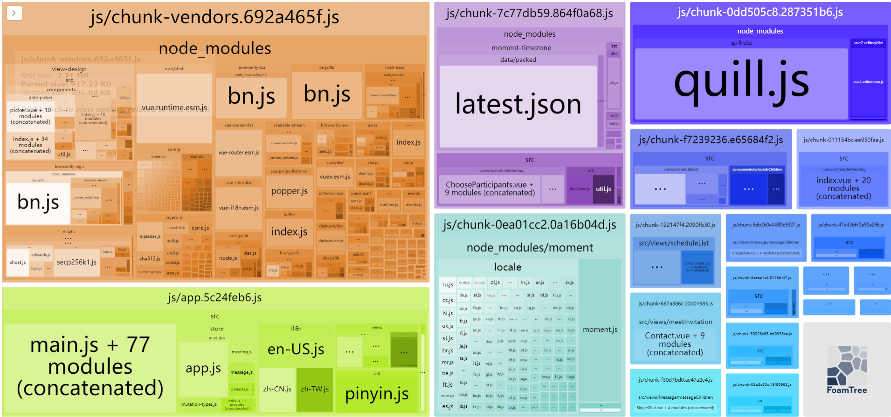

# 使用 lighthouse 分析网站性能

## 指标

使用 lighthouse 后有这样几个指标：

* FCP（First Contentful Paint）首次内容绘制。从进入页面到首次有 DOM 内容绘制所用的时间。这里的 DOM 内容指的是文本、图片、非空的 canvas 或者 SVG。
* LCP（Largest Contentful Paint）最大内容绘制。从页面开始加载到视窗内最大内容绘制的所需时间，这里的内容指文本、图片、视频、非空的 canvas 或者 SVG 等。
* CLS（Cumulative Layout Shift）累计布局位移。比较单个元素在帧与帧之间的位置偏移来计算。
* TTI（Time To Interactive）页面可交互的时间。这个时间的确定需要同时满足以下几个条件：
  * 页面开始绘制内容，即 FCP 指标开始之后
  * 用户的交互可以及时响应：
  * 页面中大部分可见的元素已经注册了对应的监听事件（通常在 DOMContentLoaded 事件之后）
  * 在 TTI 之后持续 5 秒的时间内无长任务执行（没有超过 50 ms 的执行任务 & 没有超过 2 个 GET 请求）
* TBT（Total Blocking Time）阻塞总时间，测量的是 FCP 与 TTI 之间的时间间隔。

## 优化 js

下面是一些常见优化手段：

* 合理的加载顺序/策略（延迟加载/预先加载）
* 压缩优化资源的体积
* 代码分割 & 公共提取 & 按需加载

### 用 Chrome Devtool Coverage 分析无用的代码

怎么样才能知道 js 文件中加载了不必要的资源呢？可以使用 Chrome Devtool Coverage 面板来查看。打开 Coverage 面板的步骤：

* 点击 Devtool 右上角的 Customize and control Devtools 按钮（就是三个竖直排列的小圆点），打开下拉选项框，在其中选择 `Run command`


* 然后在弹出的输入命令的面板中输入 coverage，这时候面板自动联想出打开 Coverage 面板的命令，点击即可打开 Coverage 面板。


* 然后我们刷新一下页面，就可以看到 Coverage 中显示各种加载的文件的分析结果了。其中红色代表没有被执行的代码，也就是无用代码，蓝色代表执行过的也就是有用的代码。


通过 Coverage 面板一目了然，哪些文件里无用代码过多，就可以想办法去做提取或者拆分。

### 用 webpack-bundle-analyzer 插件分析打包文件大小和组成部分

webpack-bundle-analyzer 插件可以将 webpack 编译输出的文件视觉化成一个可以交互和缩放的树状图。用来分析打包后的文件大小和包含的模块，然后可以帮助你做进一步优化。

```js
yarn add -D webpack-bundle-analyzer
```

使用的时候在 webpack 配置中添加到 plugins 里就可以了

```js
const BundleAnalyzerPlugin = require('webpack-bundle-analyzer').BundleAnalyzerPlugin;

module.exports = {
  plugins: [
    new BundleAnalyzerPlugin()
  ]
}
```



