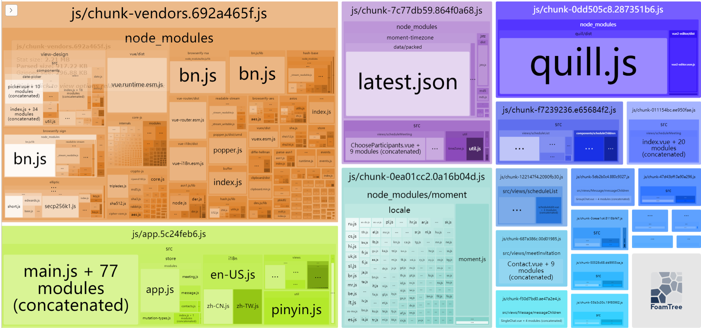
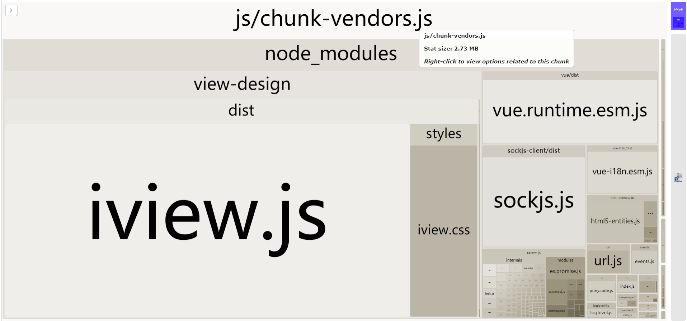
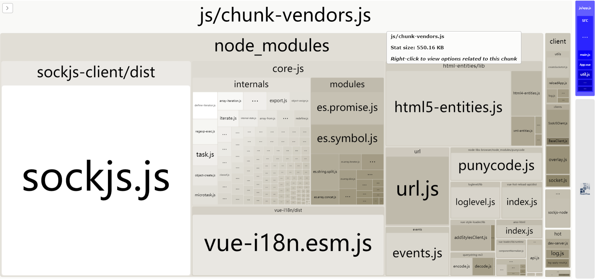

# webpack-bundle-analyzer

## 概念

webpack-bundle-analyzer 插件可以将 webpack 编译输出的文件视觉化成一个可以交互和缩放的树状图。用来分析打包后的文件大小和包含的模块，然后可以帮助你做进一步优化。

```js
yarn add -D webpack-bundle-analyzer
```

使用的时候在 webpack 配置中添加到 plugins 里就可以了

```js
const BundleAnalyzerPlugin = require('webpack-bundle-analyzer').BundleAnalyzerPlugin;

module.exports = {
  plugins: [
    new BundleAnalyzerPlugin()
  ]
}
```



## 和 externals 配合优化项目

externals 用来告诉 Webpack 要构建的代码中使用了哪些不用被打包的模块，这些模块可以是通过外部环境（如 CDN）引入的。

通过 webpack-bundle-analyzer 的分析，可以很容易找到项目打包文件中最大的第三方模块，然后将其设置到 externals 里，然后从 CDN 引入。

下面是正常引入 view-design 库时的分析图：



下面是将 view-design 和 vue 提取到 cdn 引入后的分析图：



这两个都是开发环境下的分析，可以看到将文件提取出去 cdn 引入后，对 chunk-vendors.js 文件的大小影响是非常大的。