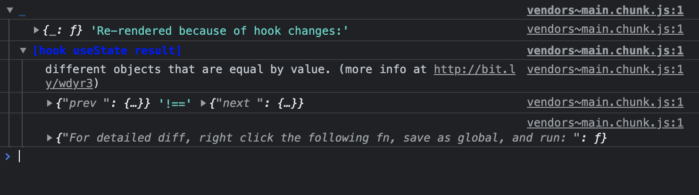
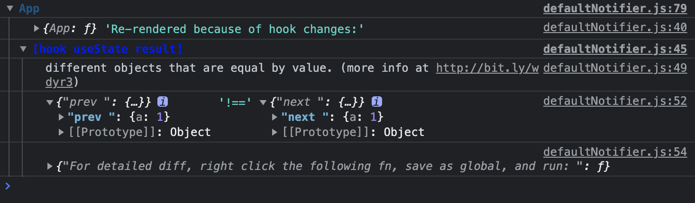

# 使用 why-did-you-render 检查多余的重复渲染

[why-did-you-render](https://www.npmjs.com/package/@welldone-software/why-did-you-render) 插件可以帮助发现 react 项目中潜在的可避免的重复渲染。

## 安装

```bash
npm install @welldone-software/why-did-you-render --save-dev

yarn add --dev @welldone-software/why-did-you-render
```

* 手动引入
  * 创建一个 wdyr.js 并且将它作为整个应用的第一个文件 import。
  ```js
    // wdyr.js
    import React from 'react';

    if (process.env.NODE_ENV === 'development') {
      const whyDidYouRender = require('@welldone-software/why-did-you-render');
      whyDidYouRender(React, {
        trackAllPureComponents: true,
      });
    }
  ```
* 使用 [wdyr-webpack-plugin](https://www.npmjs.com/package/wdyr-webpack-plugin) 引入
  ```js
    // webpack.config.js
    const WdyrWebpackPlugin = require('wdyr-webpack-plugin');

    module.exports = {
      plugins: [
        new WdyrWebpackPlugin({
          enable: process.env.NODE_ENV === 'development',
          trackAllPureComponents: true,
          // other options
        })
      ]
    }
  ```

**注意：永远不要在生产环境使用 why-did-you-render ，因为它会使 react 变慢。**

## 用法

* 如果设置了 `trackAllPureComponents: true`，那么所有的纯组件（React.PureComponent 和 React.memo）将会被此插件追踪。否则，你需要自己手动在你想要追踪的组件（类组件或函数组件）添加 whyDidYouRender 属性，值为 true 即可。（例如 MyComponent.whyDidYouRender = true）。

* 插件启用后，当页面渲染或者交互的时候，如果存在不必要的 re-render，控制台就会出现提示，如下图所示：
  
  这里出现的问题是 state 的值并未改变但是因为是引用类型所以造成了 re-render。根据这样的提示可以方便定位代码中的位置，然后一个一个解决，知道不再出现提示。

比较常见的问题是 state 变了但是值和之前相等，或者 props 变化了但是值和之前的相等。

```js
const App = () => {
  const [something, setSomething] = useState({a: 1});
  return (
    <>
      <button onClick={() => setSomething({a: 1})}>change</button>
    </>
  );
}
```

上面这个例子 something 初始值是对象 `{a: 1}`，调用 setSomething 设置新值还是 `{a: 1}`，虽然值相等，但是是一个新对象，因此造成了一次 re-render



因此这个插件最大的意义就是发现值相等，但是传递的 state 或 props 是新对象而造成的 re-render。而必然会发生 re-render 的情况它是不会提示的，所以代码中其他的不合理的 re-render 就需要自己写代码的时候多加注意了。
