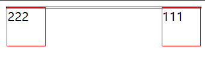

# float 和 BFC

## 概念

浮动让一个元素应沿其容器的左侧或右侧放置，允许文本和行内元素环绕它。该元素从网页的正常流中移除，尽管仍然保持部分的流动性。

当一个元素没有设置高度，子元素浮动会脱离正常流，造成父级的高度无法包住子元素。

根据 [css规范](https://drafts.csswg.org/css2/#normal-block) 原文中的描述：Only children in the normal flow are taken into account (i.e., floating boxes and absolutely positioned boxes are ignored, and relatively positioned boxes are considered without their offset). Note that the child box may be an anonymous block box.

只有正常流中的子元素才会被作为 height 的一部分计算。（浮动和绝对定位的子元素盒子会被忽略，并且相对定位的盒子的偏移会被忽略。）

```html
  <style>
    .box {
      border: 1px solid #000;
    }
    .left {
      height: 50px;
      width: 50px;
      float: left;
      border: 1px solid rgb(255, 0, 0);
    }
    .right {
      height: 50px;
      width: 50px;
      float: right;
      border: 1px solid rgb(255, 0, 0);
    }
  </style>
  <div class="box">
    <div class="left">222</div>
    <div class="right">111</div>
  </div>
```



想要解决脱离文档流造成父级包不住浮动子元素的问题，就需要清除浮动。

## 清除浮动

1. 让父级也浮动。（触发 BFC）

```css
    .box {
      border: 1px solid #000;
      float: left;
    }
```

2. 让父级绝对定位（触发 BFC）

```css
    .box {
      border: 1px solid #000;
      position: absolute;
    }
```

3. 父级设置 overflow: hidden;（触发 BFC）

```css
    .box {
      border: 1px solid #000;
      overflow: hidden;
    }
```

4. 设置父元素 display: flow-root;（触发 BFC）

```css
    .box {
      border: 1px solid #000;
      display: flow-root;
    }
```

5. 父级添加伪元素设置 clear

```css
    .box::after {
      content: '';
      clear: both;
      display: block;
    }
```

clear 属性让添加的这个伪元素的无论哪个方向（both 左边和右边）都不会出现浮动元素，所以伪元素只能到最下方另起一个新行。并且必须设置伪元素为 display: block; 因为伪元素默认为 inline 元素。为什么必须要 display: block？因为根据 [css规范](https://drafts.csswg.org/css2/#flow-control) Note. This property applied to all elements in CSS1. Implementations may therefore have supported this property on all elements. In CSS2 (1998) and CSS 2 the clear property only applies to block-level elements. Therefore authors should only use this property on block-level elements. clear 属性只作用于块级元素。

## BFC

块格式化上下文（Block Formatting Context，BFC） 是 Web 页面的可视 CSS 渲染的一部分，是块盒子的布局过程发生的区域，也是浮动元素与其他元素交互的区域。

* 生成 BFC 的元素的子元素会一个接一个的放置。
* 垂直方向上他们的起点是一个包含块的顶部，两个相邻子元素之间的垂直距离取决于元素的 margin 特性。在 BFC 中相邻的块级元素的外边距会折叠 (Mastering margin collapsing)。
* 生成 BFC 元素的子元素中，每一个子元素左外边距与包含块的左边界相接触（对于从右到左的格式化，右外边距接触右边界），即使浮动元素也是如此（尽管子元素的内容区域会由于浮动而压缩），除非这个子元素也创建了一个新的 BFC（如它自身也是一个浮动元素）。

以下方式会创建 BFC：

* 根元素（`<html>`）
* 浮动元素（元素的 float 不是 none）
* 绝对定位元素（元素的 position 为 absolute 或 fixed）
* overflow 计算值(Computed)不为 visible 的块元素
* display 值为 flow-root 的元素
* 行内块元素（元素的 display 为 inline-block）
* 表格单元格（元素的 display 为 table-cell，HTML表格单元格默认为该值）
* 表格标题（元素的 display 为 table-caption，HTML表格标题默认为该值）
* 匿名表格单元格元素（元素的 display 为 table、table-row、 table-row-group、table-header-group、table-footer-group（分别是HTML table、row、tbody、thead、tfoot 的默认属性）或 inline-table）
* contain 值为 layout、content 或 paint 的元素
* 弹性元素（display 为 flex 或 inline-flex 元素的直接子元素）
* 网格元素（display 为 grid 或 inline-grid 元素的直接子元素）
* 多列容器（元素的 column-count 或 column-width (en-US) 不为 auto，包括 column-count 为 1）
* column-span 为 all 的元素始终会创建一个新的BFC，即使该元素没有包裹在一个多列容器中

其中最常见的就是：

* 浮动元素（元素的 float 不是 none）
* 绝对定位元素（元素的 position 为 absolute 或 fixed）
* overflow 计算值(Computed)不为 visible 的块元素
* display 值为 flow-root 的元素
* 行内块元素（元素的 display 为 inline-block）

### BFC 特点

* 内部的盒子会在垂直方向上一个接一个的放置（这里应该指块盒子）
* 内部的盒子垂直方向上的距离由 margin 决定。（完整的说法是：属于同一个 BFC 的两个相邻盒子的 margin 会发生折叠，不同 BFC 不会发生折叠。）
* 每个元素的左外边距与包含块的左边界相接触（从左向右），即使浮动元素也是如此。（这说明 BFC 中子元素不会超出他的包含块，而 position 为 absolute 的元素可以超出他的包含块边界）
* BFC 的区域不会与 float 的元素区域重叠
* 计算 BFC 的高度时，浮动子元素也参与计算。


根据 [css规范链接](https://drafts.csswg.org/css2/#root-height) In addition, if the element has any floating descendants whose bottom margin edge is below the element’s bottom content edge, then the height is increased to include those edges. Only floats that participate in this block formatting context are taken into account, e.g., floats inside absolutely positioned descendants or other floats are not.

另外，如果一个元素 A 拥有任何浮动的后代元素并且这些后代元素的 margin-bottom 的边缘在这个元素 A 的内容的下方的边缘之下，那么元素 A 的高度会包含这超出的边缘。**但只有在这些浮动后代元素处于元素 A 的 BFC 的时候才会生效**。

也就是说如果父元素生成了 BFC，那么其浮动子元素就会参与父元素的高度计算，父元素就可以包住它们了。

这就是 BFC 解决父级无法包住浮动子元素的原因。