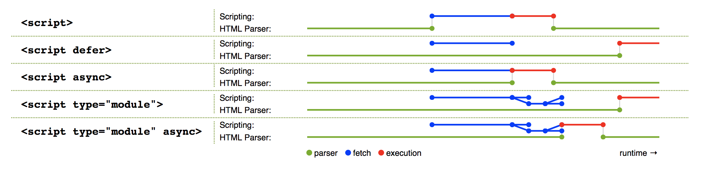

# script 标签

```html
<script src="./test.js"></script>
<script src="./test.js" defer></script>
<script src="./test.js" async></script>
<script src="./test.js" type="module"></script>
```
`<script>` 元素用于嵌入或引用可执行脚本。它有几个特殊的属性能够影响浏览器解析页面的流程。

* 默认情况下，浏览器是同步加载 JavaScript 脚本，即渲染引擎遇到 `<script>` 标签就会停下来，等到执行完脚本，再继续向下渲染。如果是外部脚本，还必须加入脚本下载的时间。如果脚本体积很大，下载和执行的时间就会很长，因此造成浏览器堵塞，用户会感觉到浏览器“卡死”了，没有任何响应。

* 如果在 script 标签上添加了 async 和 defer 属性，script 引用的外部脚本就会异步下载。它俩的区别是，defer 是等到整个页面 dom 结构生成完了，其他脚本执行完了，再执行；而 async 是一旦脚本下载完毕，页面会中断渲染，立即执行脚本，脚本执行完了再接着渲染页面。一句话，defer 是渲染完再执行，async 是下载完就执行。如果有多个 defer 脚本，会按照它们在页面出现的顺序加载，而多个 async 脚本是不能保证加载顺序的。

* 带有 type="module" 的 `<script>`，都是异步加载，即等到整个页面渲染完，再执行模块脚本，相当于和 defer 一样的效果。如果网页有多个 `<script type="module">`，它们会按照在页面出现的顺序依次执行。`<script>` 标签的 async 属性也可以打开，打开后和 async 效果一样。

