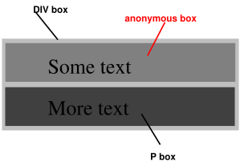

# 视觉格式模型

## 简介

在视觉格式化模型（visual formatting model）中，文档树中的每一个元素会根据盒模型去生成零个或多个盒子。这些盒子的布局被以下因素所控制：

* 盒子的尺寸和类型
* 定位方案（正常流，浮动，绝对定位）
* 文档树中元素的关系
* 其他因素（视口大小，图片固有尺寸等等）

### 视口（viewport）

连续媒体（网页就是一种连续媒体）的用户代理（用户代理就是浏览器）通常为用户提供一个视口（屏幕上的窗口或其他查看区域），用户通过它查阅文档。用户代理可能会在调整视口大小时更改文档的布局。

当视口小于呈现文档的画布区域时，用户代理应提供滚动机制。

每个画布最多有一个视口，但用户代理可能会渲染到多个画布（即，提供同一文档的不同视图）。

### 包含块（containing block）

在 CSS 2 中，许多盒子的位置和大小是相对于称为 `包含块` 的矩形框的边缘计算的。一般情况下，文档中的盒子是它的后代元素的`包含块`，换一个说法，这个盒子为它的后代元素生成了一个 `包含块`。 “盒子的包含块”是指这个盒子所在的`包含块`，而不是这个盒子生成的`包含块`。

每个盒子都有一个相对于它的`包含块`的位置，但它不受这个`包含块`的限制；它可能会溢出。

## 控制盒子生成（Controlling box generation）

下面介绍盒子的种类。

### 块级元素和块盒子（Block-level elements and block boxes）

**块级元素**（Block-level elements）是源文档中在视觉上被格式化为块（例如，段落）的那些元素。display 属性的以下值使元素成为块级：block、list-item 和 table。

**块级盒子**（Block-level boxes）是参与`块格式化上下文`（block formatting context）的盒子。每个`块级元素`生成一个**主要的块级盒子**，其中包含后代盒子和生成的内容，这个**主要的块级盒子**也是任何定位方案中涉及的盒子。

一些`块级元素`可能会生成**主要块级盒子**之外的盒子：例如 list-item 元素。这些附加的盒子相对于**主要块级盒子**放置。

除了表格盒子和替换元素以外，`块级盒子`（block-level box）也是`块容器盒子`（block container box）。一个`块容器盒子`要么只包含`块级盒子`，要么创建一个`内联格式化上下文`（inline formatting context）只包含`内联级盒子`。并非所有`块容器盒子`都是`块级盒子`：未替换的内联块和未替换的表格单元格都是`块容器盒子`但是不是`块级盒子`。如果一个盒子既是`块容器盒子`，也是`块级盒子`，那么它被称作，`块盒子`（block box）。

`块级盒子`（block-level box），`块容器盒子`（block container box）和 `块盒子`（block box）有时在明确的情况下缩写为“块”。

#### 匿名块盒子（Anonymous block boxes）

```html
<DIV>
  Some text
  <P>More text
</DIV>
```

（假设 div 和 p 都是 display: 'block'）。div 同时拥有内联内容和块内容，为了更容易定义格式，我们假设在 “Some text” 周围有一个`匿名块盒子`。




换句话来说：如果一个`块容器盒子`（上例中 div 会生成一个`块容器盒子`）的内部有一个`块级盒子`（上例中的 p 元素），那么我们会强迫这个`块容器盒子`中只能存在`块级盒子`。

当一个`内联盒子`包含了一个 `在流内`（in-flow，与之对应的是 Out of Flow，脱离流）的`块级盒子`，那么这个`内联盒子`（以及和它在同一个 行盒子 （line box） 的内联祖先）会在`块级盒子`（以及任何连续的或者仅由于可折叠的空白分隔的块级兄弟盒子，以及其他脱离流的元素）的周围被破坏掉，然后这个`内联盒子`被分裂成两个盒子（即使有一侧是空的没有内容），被分裂的两个盒子在`块级盒子`的两侧。中断之前和中断之后的行盒子都被包含在`匿名块盒`中，并且`块级盒子`会变成这些`匿名盒子`的兄弟盒子。当这样一个`内联盒子`收到相对定位的影响时，任何最终的转变也会影响`内联盒子`中的`块级盒子`。

```html
p    { display: inline }
span { display: block }

<!DOCTYPE HTML PUBLIC "-//W3C//DTD HTML 4.01//EN">
<HEAD>
    <TITLE>Anonymous text interrupted by a block</TITLE>
</HEAD>
<BODY>
    <P>
        This is anonymous text before the SPAN.
        <SPAN>This is the content of SPAN.</SPAN>
        This is anonymous text after the SPAN.
    </P>
</BODY>
```

P 元素包含一个匿名文本块 (C1)，后跟一个`块级元素`，然后是另一个匿名文本块 (C2)。生成的盒子将是一个代表 BODY 的块盒子，包含一个围绕 C1 的`匿名块盒子`、SPAN 块盒子和另一个围绕 C2 的`匿名块盒子`。


`匿名盒子`的属性继承自封闭的非匿名盒子（例如，在小节匿名块盒子示例中，DIV 的属性）。非继承属性有它们的初始值。比如匿名盒的字体是继承自 DIV，但是边距为 0。

在导致生成`匿名块盒`的元素上设置的属性仍然适用于`匿名盒子`和该元素的内容。例如，如果在上面的示例中在 P 元素上设置了边框，则边框将围绕 C1（在行尾打开）和 C2（在行开头打开）绘制。

一些用户代理已经以其他方式在内联包含块上实现了边界，例如，通过将这些嵌套块包裹在“匿名行盒”内，从而在这些盒子周围绘制内联边界。由于 CSS1 和 CSS2 (1998) 没有定义这个行为，CSS1-only 和 CSS2 (1998)-only 用户代理可以实现这个替代模型，并且仍然声称符合 CSS 2 的这一部分。这不适用于这个规范发布之后开发好的用户代理。

在解析引用它的百分比值时，`匿名块盒`将被忽略：改为使用最近的非匿名祖先盒子。例如，如果上面 DIV 内`匿名块盒`的子节点需要知道其`包含块`的高度来解析百分比高度，那么它将使用 DIV 形成的`包含块`的高度，而不是`匿名块盒`的高度。

### 内联级别元素和内联盒（Inline-level elements and inline boxes）

**内联级别元素**（Inline-level element）是不产生新的内容块的元素。内容按行分布（例如，段落中强调的文本片段、内联图像等）。display 属性的以下值使元素成为内联级别：inline、inline-table 和 inline-block。

内联级元素生成**内联盒子**，它们是参与`内联格式上下文`（inline formatting context）的盒子。

一个**内联盒子**是一种既是内联级别的，并且其内容参与其包含的`内联格式上下文`。display 为 inline 的非替换元素生成`内联盒子`。不是`内联盒子`的`内联级别盒子`（例如替换的内联级元素、inline-block 元素和 inline-table 元素）被称为**原子内联级盒子**（atomic inline-level box）因为它们作为单个不透明盒子参与其`内联格式化上下文`。

#### 匿名内联盒子（Anonymous inline boxes）

任何直接包含在`块容器元素`内（而不是`内联元素`内）的文本都必须被视为`匿名内联元素`。

```html
<p>
    Some <em>emphasized</em> text
</p>
```

上例中 p 生成一个块盒子，其内部有几个行内盒子。“强调”的盒子是由内联元素 em 生成的`内联盒子`，但其他盒子（“Some” 和 “text”）是由块级元素 p 生成的内联盒子。后者称为`匿名内联盒`，因为它们没有关联的`内联级元素`。

这种`匿名内联盒`从它们的块父亲盒子继承可继承的属性。非继承属性有它们的初始值。在示例中，`匿名内联盒`的颜色是从 P 继承的，但背景是透明的。

空白内容会根据 white-space 属性被折叠掉而不会生成任何`匿名内联盒`。

如果从上下文中明确表示匿名盒子的类型，那么`匿名内联盒`和`匿名块盒`在本规范中都简称为`匿名盒`。

格式化表格时会出现更多类型的`匿名盒`。

### display 属性

display 属性可以取的值：

block | inline | inline-block | list-item | table | inline-table | table-row-group | table-header-group | table-footer-group | table-row | table-column-group | table-column | table-cell | table-caption | none | inherit


|   值   |  描述  |
|  ----  | ----  |
|  block  | 使元素生成`块盒`  |
|  inline  | 使元素生成一个或多个`内联盒`  |
|  inline-block  | 使元素生成一个`内联级别块容器`。inline-block 内部被格式化为`块盒`，而这个元素本身被格式化为`原子内联级盒子`  |
|  list-item  |  使元素生成主要块盒和一个标记盒。例如 li 元素  |
|  none  |  不生成盒子  |
|   table inline-table table-row-group table-header-group table-footer-group table-row table-column-group table-column table-cell table-caption  |  使元素的行为类似表格元素  |


## 定位方案

在 CSS 2 中，一个盒子可以根据三种定位方案进行布局：

* `正常流`（Normal flow）。在 CSS 2 中，`正常流`包括`块级盒子`的`块格式`、`内联级别盒子`的`内联格式`以及块级和内联级的相对定位。
* `浮动`。在浮动模型中，首先按照`正常流`布置一个盒子，然后从流中取出它并尽可能地向左或向右移动。内容可能会沿着浮动的一侧流动。
* `绝对定位`。在绝对定位模型中，一个盒子被完全从`正常流`中移除（它对后面的兄弟没有影响）并分配一个相对于`包含块`的位置。

如果一个元素 浮动了，或者绝对定位了，或者是根元素，那么这个元素被称为 `脱离流`（out-of-flow）。没有`脱离流`的元素被成为 `在流内`（in-flow）。一个元素 A 的流就是指元素 A 本身和所有`在流内`元素的集合，其最近的`脱离流`的祖先就是 A。

### position 属性

position 有以下取值：

static | relative | absolute | fixed | inherit

|   值   |  描述  |
|  ----  | ----  |
|  static  | 普通盒子，按照`正常流`布局。  |
|  relative  | 盒子的位置是按照`正常流`计算的。盒子相对于它的正常位置偏移。当一个盒子 B 使用相对定位发生偏移时，则它后面的其它盒子的位置被计算为好像 B 没有发生偏移。  |
|  absolute  | 盒子的位置由 top right bottom left 的值来决定，这四个属性指定的偏移基于盒子的`包含块`。绝对定位的元素会脱离`正常流`。这意味着它们对之后的兄弟元素的布局没有影响。此外，虽然绝对定位盒子有 margin，但是不会和其他 margin 发生折叠。 |
|  fixed  |  相对于屏幕视口的位置来指定元素位置  |


### 盒子偏移量 top bottom left right

一个元素如果它的 position 属性的值不是 static。则会根据这四个属性进行布局：

* top 用于指定绝对定位的盒子的上外边距边沿在下方距离盒子的`包含块`的上边沿的偏移，对于相对定位盒子，偏移量是相对于盒子本身的顶部边沿。
* right 指定绝对定位的盒子的右外边距边沿在左方距离盒子的`包含块`的右边沿的偏移，对于相对定位盒子，偏移量是相对于盒子本身的右边沿。
* bottom 指定盒子的下外边距边沿在上方距离盒子的`包含块`的下边沿的偏移，对于相对定位盒子，偏移量相对于盒子本身的下边沿。
* left 指定盒子的左外边距边沿在右方距离盒子的`包含块`的左边沿的偏移，对于相对定位盒子，偏移量相对于盒子本身的左边沿。

## 正常流（Normal flow）

`正常流`中的盒子属于`格式化上下文`, 可以是块或内联，但不能同时进行。块级盒子参与`块格式化上下文`。内联级盒子参与`内联格式上下文`。

### 块格式上下文（Block formatting contexts）

浮动、绝对定位元素、不是块盒子的块容器（例如inline-blocks, table-cells, and table-captions），以及设置了 overflow 属性值不为 visible 的块盒子（除非该值已传播到视口）为其内容建立新的`块格式化上下文`。

在`块格式化上下文`中，盒子从`包含块`的顶部开始一个接一个地垂直排列。两个兄弟盒子之间的垂直距离由 margin 属性决定。`块格式上下文`中相邻`块级盒子`之间的垂直边距会发生折叠。

在`块格式上下文`中，每个盒子的左外边缘接触`包含块`的左边缘（对于从右到左的格式化，右边缘接触）。即使在存在浮动的情况下也是如此（尽管盒子的`行盒`可能会因浮动而缩小），除非盒子建立了新的`块格式化上下文`（在这种情况下，盒子本身可能会因浮动而变窄）。

### 内联格式上下文（Inline formatting contexts）

在`内联格式化上下文`中，盒子从`包含块`的顶部开始一个接一个地水平排列。这些盒子之间的布局位置遵循水平方向 margin、border 和 padding。这些盒子可以以不同的方式垂直对齐：它们的底部或顶部可以对齐，或者它们内文本的基线可以对齐。包含形成一条线的多个盒子的矩形区域称为`行盒`（line box）。

`行盒`的宽度由`包含块`和浮动的存在决定。`行盒`的高度由行高计算一节中给出的规则决定。

一个`行盒`对于它包含的所有盒子来说总是足够高的。但是，它可能比它包含的最高的盒子还要高（例如，如果盒子对齐以便基线对齐）。当盒子 B 的高度小于包含它的`行盒`的高度时，B 在`行盒`内的垂直对齐方式由 vertical-align 属性决定。当多个`内联级盒子`无法水平放置在单个`行盒`中时，它们会分布在两个或多个垂直堆叠的`行盒`中。因此，一个段落是垂直方向的多个`行盒`。`行盒`堆叠时没有垂直分隔（除非在其他地方指定）并且它们从不重叠。

