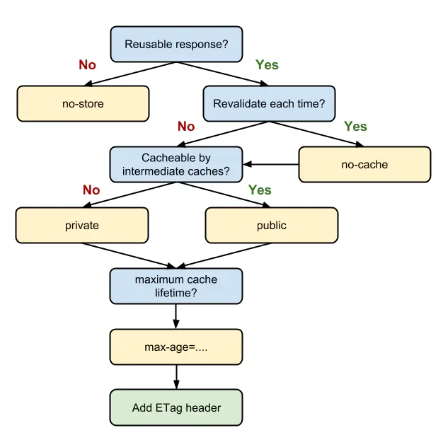

# 缓存

## 按缓存位置分类

我们可以在 Chrome 的开发者工具中，Network -> Size 一列看到一个请求最终的处理方式：如果是资源大小 (多少 K， 多少 M 等) 就表示是网络请求，否则会列出 from memory cache, from disk cache 和 from ServiceWorker。它们的优先级是：(由上到下寻找，找到即返回；找不到则继续)

1. Service Worker
2. Memory Cache
3. Disk Cache
4. 网络请求

###  memory cache

memory cache 是内存中的缓存，(与之相对 disk cache 就是硬盘上的缓存)。按照操作系统的常理：先读内存，再读硬盘。

几乎所有的网络请求资源都会被浏览器自动加入到 memory cache 中。但是也正因为数量很大但是浏览器占用的内存不能无限扩大这样两个因素，memory cache 注定只能是个“短期存储”。常规情况下，浏览器的 TAB 关闭后该次浏览的 memory cache 便告失效 (为了给其他 TAB 腾出位置)。而如果极端情况下 (例如一个页面的缓存就占用了超级多的内存)，那可能在 TAB 没关闭之前，排在前面的缓存就已经失效了。
刚才提过，几乎所有的请求资源 都能进入 memory cache，这里细分一下主要有两块：

1. preloader。

* 浏览器通常会准备两个页面解析器parser，一个(main parser)用于正常的页面解析，而另一个(preloader)则试图去文档中搜寻更多需要加载的资源，但这里的资源通常仅限于外链的js、stylesheet、image；不包括audio、video等。并且动态插入页面的资源无效。但细节方面却值得注意：
* 比如关于preloader的触发时机，并非与解析页面同时开始，而通常是在加载某个head中的外链脚本阻塞了main parser的情况下才启动；
* 也不是所有浏览器的preloader会把图片列为预加载的资源，可能它认为图片加载过于耗费带宽而不把它列为预加载资源之列；
* preloader也并非最优，在某些浏览器中它会阻塞body的解析。因为有的浏览器将页面文档拆分为head和body两部分进行解析，在head没有解析完之前，body不会被解析。一旦在解析head的过程中触发了preloader，这无疑会导致head的解析时间过长。

被 preloader 请求来的资源就会被放入 memory cache 中，供之后的解析执行操作使用。

2. preload  <link rel="preload">。这些显式指定的预加载资源，也会被放入 memory cache 中。

memory cache 机制保证了一个页面中如果有两个相同的请求 (例如两个 src 相同的 ，两个 href 相同的 <link>)都实际只会被请求最多一次，避免浪费。
不过在匹配缓存时，除了匹配完全相同的 URL 之外，还会比对他们的类型，CORS 中的域名规则等。因此一个作为脚本 (script) 类型被缓存的资源是不能用在图片 (image) 类型的请求中的，即便他们 src 相等。

在从 memory cache 获取缓存内容时，浏览器会忽视例如 max-age=0, no-cache 等头部配置。例如页面上存在几个相同 src 的图片，即便它们可能被设置为不缓存，但依然会从 memory cache 中读取。这是因为 memory cache 只是短期使用，大部分情况生命周期只有一次浏览而已。而 max-age=0 在语义上普遍被解读为“不要在下次浏览时使用”，所以和 memory cache 并不冲突。

但如果站长是真心不想让一个资源进入缓存，就连短期也不行，那就需要使用 no-store。存在这个头部配置的话，即便是 memory cache 也不会存储，自然也不会从中读取了。(后面的第二个示例有关于这点的体现)

### disk cache

disk cache 也叫 HTTP cache，顾名思义是存储在硬盘上的缓存，因此它是持久存储的，是实际存在于文件系统中的。而且它允许相同的资源在跨会话，甚至跨站点的情况下使用，例如两个站点都使用了同一张图片。

disk cache 会严格根据 HTTP 头信息中的各类字段来判定哪些资源可以缓存，哪些资源不可以缓存；哪些资源是仍然可用的，哪些资源是过时需要重新请求的。当命中缓存之后，浏览器会从硬盘中读取资源，虽然比起从内存中读取慢了一些，但比起网络请求还是快了不少的。绝大部分的缓存都来自 disk cache。

凡是持久性存储都会面临容量增长的问题，disk cache 也不例外。在浏览器自动清理时，会有神秘的算法去把“最老的”或者“最可能过时的”资源删除，因此是一个一个删除的。不过每个浏览器识别“最老的”和“最可能过时的”资源的算法不尽相同，可能也是它们差异性的体现。

### Service Worker

上述的缓存策略以及缓存/读取/失效的动作都是由浏览器内部判断进行的，我们只能设置响应头的某些字段来告诉浏览器，而不能自己操作。但 Service Worker 的出现，给予了我们另外一种更加灵活，更加直接的操作方式。

Service Worker 能够操作的缓存是有别于浏览器内部的 memory cache 或者 disk cache 的。我们可以从 Chrome 的 F12 中，Application -> Cache Storage 找到它。除了位置不同之外，这个缓存是永久性的，即关闭 TAB 或者浏览器，下次打开依然还在(而 memory cache 不是)。有两种情况会导致这个缓存中的资源被清除：手动调用 API cache.delete(resource) 或者容量超过限制，被浏览器全部清空。

如果 Service Worker 没能命中缓存，一般情况会使用 fetch() 方法继续获取资源。这时候，浏览器就去 memory cache 或者 disk cache 进行下一次找缓存的工作了。注意：经过 Service Worker 的 fetch() 方法获取的资源，即便它并没有命中 Service Worker 缓存，甚至实际走了网络请求，也会标注为 from ServiceWorker。


### 总结

1. 根据 Service Worker 中的 handler 决定是否存入 Cache Storage (额外的缓存位置)。
2. 根据 HTTP 头部的相关字段(Cache-control, Pragma 等)决定是否存入 disk cache
3. memory cache 保存一份资源 的引用，以备下次使用。

## 按失效策略分类

memory cache 是浏览器为了加快读取缓存速度而进行的自身的优化行为，不受开发者控制，也不受 HTTP 协议头的约束，算是一个黑盒。Service Worker 是由开发者编写的额外的脚本，且缓存位置独立，出现也较晚，使用还不算太广泛。所以我们平时最为熟悉的其实是 disk cache，也叫 HTTP cache (因为不像 memory cache，它遵守 HTTP 协议头中的字段)。

### 强缓存

* 强制缓存的含义是，当客户端请求后，会先访问缓存数据库看缓存是否存在。如果存在则直接返回；不存在则请求真的服务器，响应后再写入缓存。
* 强制缓存直接减少请求数，是提升最大的缓存策略。
* 可以造成强制缓存的字段是 Cache-control 和 Expires。

#### Expires

这是一个响应头。这是 HTTP 1.0 的字段，表示缓存到期时间，是一个绝对的时间 (当前时间+缓存时间)，如

```js
Expires: Thu, 10 Nov 2017 08:45:11 GMT
```

在响应消息头中，设置这个字段之后，就可以告诉浏览器，在未过期之前不需要再次请求。

两个缺点：
1. 由于是绝对时间，用户可能会将客户端本地的时间进行修改，而导致浏览器判断缓存失效，重新请求该资源。此外，即使不考虑自身修改，时差或者误差等因素也可能造成客户端与服务端的时间不一致，致使缓存失效。
2. 写法太复杂了。表示时间的字符串多个空格，少个字母，都会导致非法属性从而设置失效。

#### Cache-control

已知 Expires 的缺点之后，在 HTTP/1.1 中，增加了一个字段 Cache-control，该字段表示资源缓存的最大有效时间，在该时间内，客户端不需要向服务器发送请求

这两者的区别就是前者是绝对时间，而后者是相对时间。如下：

```js
Cache-control: max-age=2592000
```
Cache-control 中指令设计具体时间的，单位都是秒。

面列举一些 Cache-control 字段常用的指令：

1. max-age：即最大有效时间，在上面的例子中我们可以看到
2. must-revalidate：如果超过了 max-age 的时间，浏览器必须向服务器发送请求，验证资源是否还有效。
3. no-cache：虽然字面意思是“不要缓存”，但实际上还是要求客户端缓存内容的，只是缓存需要在验证之后使用。
4. no-store: 真正意义上的“不要缓存”。所有内容都不走缓存，包括强制和对比。
5. public：所有的内容都可以被缓存 (包括客户端和代理服务器， 如 CDN)
6. private：所有的内容只有客户端才可以缓存，代理服务器不能缓存。默认值

这些值可以混合使用，例如 Cache-control:public, max-age=2592000。在混合使用时，它们的优先级如下图：



* 这里有一个疑问：max-age=0 和 no-cache 等价吗？
    * 从规范的字面意思来说，max-age 到期是 应该(SHOULD) 重新验证，而 no-cache 是 必须(MUST) 重新验证。但实际情况以浏览器实现为准，大部分情况他们俩的行为还是一致的。（如果是 max-age=0, must-revalidate 就和 no-cache 等价了）

* 在 HTTP/1.1 之前，如果想使用 no-cache，通常是使用 Pragma 字段，如 Pragma: no-cache(这也是 Pragma 字段唯一的取值)。但是这个字段只是浏览器约定俗成的实现，并没有确切规范，因此缺乏可靠性。它应该只作为一个兼容字段出现，在当前的网络环境下其实用处已经很小。

* 自从 HTTP/1.1 开始，Expires 逐渐被 Cache-control 取代。Cache-control 是一个相对时间，即使客户端时间发生改变，相对时间也不会随之改变，这样可以保持服务器和客户端的时间一致性。而且 Cache-control 的可配置性比较强大。

* Cache-control 的优先级高于 Expires，为了兼容 HTTP/1.0 和 HTTP/1.1，实际项目中两个字段我们都会设置。

* 总结
    * http 1.0 的时候想使用 Cache-control: no-cache，只能使用 Pragma: no-cache。现在已经不用 Pragma 了
    * Cache-control 优先级比 Expires 高，而且 Expires 的值是绝对时间，包含年月日星期等部分，太复杂，而且用户可以修改系统时间造成 Expires 失效。Cache-control 中的时间都是相对时间，相对于请求的时间，单位为秒。所以 Expires 也不用了。

### 协商缓存（对比缓存）

当强制缓存失效(超过规定时间)时，就需要使用对比缓存，由服务器决定缓存内容是否失效。

* 浏览器先请求缓存数据库，返回一个缓存标识。之后浏览器拿这个标识和服务器通讯。如果缓存未失效，则返回 HTTP 状态码 304 Not Modified 表示继续使用，于是客户端继续使用缓存；如果失效，则返回新的数据和缓存规则，浏览器响应数据后，再把规则写入到缓存数据库。

* 对比缓存在请求数上和没有缓存是一致的，但如果是 304 Not Modified 的话，返回的仅仅是一个状态码而已，并没有实际的文件内容，因此 在响应体体积上的节省是它的优化点。通过减少响应体体积，来缩短网络传输时间。所以和强制缓存相比提升幅度较小，但总比没有缓存好。

* 对比缓存是可以和强制缓存一起使用的，作为在强制缓存失效后的一种后备方案。实际项目中他们也的确经常一同出现。

对比缓存有 2 组字段(不是两个)：

#### Last-Modified (响应头) & If-Modified-Since（请求头）

1. 服务器通过 Last-Modified 字段告知客户端，资源最后一次被修改的时间，例如

```js
Last-Modified: Mon, 10 Nov 2018 09:10:11 GMT
```

2. 浏览器将这个值和内容一起记录在缓存数据库中。
3. 下一次请求相同资源时时，浏览器从自己的缓存中找出“不确定是否过期的”缓存。因此在请求头中将上次的 Last-Modified 的值写入到请求头的 If-Modified-Since 字段
4. 服务器会将 If-Modified-Since 的值与资源的最后修改时间进行对比。如果相等，则表示未修改，响应 304 Not Modified；反之，则表示修改了，响应 200 状态码，并返回新的数据数据和新的 Last-Modified。

* 缺点
    * 如果资源更新的速度是秒以下单位，那么 Last-Modified 是感知不到的，因为它的时间单位最低是秒。
    * 一些文件也许会周期性的更改，但是内容并不改变(仅仅改变的修改时间)，这个时候，我们并不希望客户端认为这个文件被修改了，而重新去请求

#### ETag（响应头）& If-None-Match（请求头）

为了解决上述问题，出现了一组新的字段 ETag 和 If-None-Match

ETag 存储的是文件的特殊标识(一般都是 hash 生成的)，服务器存储着文件的 ETag 字段。之后的流程和 Last-Modified 一致，只是 Last-Modified 字段和它所表示的更新时间改变成了 ETag 字段和它所表示的文件 hash，把 If-Modified-Since 变成了 If-None-Match。服务器同样进行比较，命中返回 304, 不命中返回新资源和 200。

ETag 的优先级高于 Last-Modified。

### 缓存总结

当浏览器要请求资源时：

* 调用 Service Worker 的 fetch 事件响应
* 查看 memory cache
* 查看 disk cache。这里又细分：
    * 如果有强制缓存且未失效，则使用强制缓存，不请求服务器。这时的状态码全部是 200
    * 如果有强制缓存但已失效，使用协商缓存，比较后确定 304 还是 200
* 发送网络请求，等待网络响应
* 把响应内容存入 disk cache (如果 HTTP 头信息配置可以存的话)
* 把响应内容的引用存入 memory cache (无视 HTTP 头信息的配置)
* 把响应内容存入 Service Worker 的 Cache Storage (如果 Service Worker 的脚本调用了 cache.put())

## 浏览器的行为

所谓浏览器的行为，指的就是用户在浏览器如何操作时，会触发怎样的缓存策略。主要有 3 种：

1. 打开网页，地址栏输入地址： 查找 disk cache 中是否有匹配。如有则使用；如没有则发送网络请求。
2. 普通刷新 (F5)：因为 TAB 并没有关闭，因此 memory cache 是可用的，会被优先使用(如果匹配的话)。其次才是 disk cache。
3. 强制刷新 (Ctrl + F5)：浏览器不使用缓存，因此发送的请求头部均带有 Cache-control: no-cache(为了兼容，还带了 Pragma: no-cache)。服务器直接返回 200 和最新内容。

## 应用

* 不常变化的资源

```js
Cache-Control: max-age=31536000
```

通常在处理这类资源资源时，给它们的 Cache-Control 配置一个很大的 max-age=31536000 (一年)，这样浏览器之后请求相同的 URL 会命中强制缓存。而为了解决更新的问题，就需要在文件名(或者路径)中添加 hash， 版本号等动态字符，之后更改动态字符，达到更改引用 URL 的目的，从而让之前的强制缓存失效 (其实并未立即失效，只是不再使用了而已)。

在线提供的类库 (如 jquery-3.3.1.min.js, lodash.min.js 等) 均采用这个模式。如果配置中还增加 public 的话，CDN 也可以缓存起来，效果拔群。

这个模式的一个变体是在引用 URL 后面添加参数 (例如 ?v=xxx 或者 ?_=xxx)，这样就不必在文件名或者路径中包含动态参数，满足某些完美主义者的喜好。在项目每次构建时，更新额外的参数 (例如设置为构建时的当前时间)，则能保证每次构建后总能让浏览器请求最新的内容。

* 经常变化的资源

```js
Cache-Control: no-cache
```

这里的资源不单单指静态资源，也可能是网页资源，例如博客文章。这类资源的特点是：URL 不能变化，但内容可以(且经常)变化。我们可以设置 Cache-Control: no-cache 来迫使浏览器每次请求都必须找服务器验证资源是否有效。

既然提到了验证，就必须 ETag 或者 Last-Modified 出场。这些字段都会由专门处理静态资源的常用类库(例如 koa-static)自动添加，无需开发者过多关心。

也正如上文中提到协商缓存那样，这种模式下，节省的并不是请求数，而是请求体的大小。所以它的优化效果不如模式 1 来的显著。

* 非常危险的模式 1 和 2 的结合 （反例）

```js
Cache-Control: max-age=600, must-revalidate
```

不知道是否有开发者从模式 1 和 2 获得一些启发：模式 2 中，设置了 no-cache，相当于 max-age=0, must-revalidate。我的应用时效性没有那么强，但又不想做过于长久的强制缓存，我能不能配置例如 max-age=600, must-revalidate 这样折中的设置呢？

表面上看这很美好：资源可以缓存 10 分钟，10 分钟内读取缓存，10 分钟后和服务器进行一次验证，集两种模式之大成，但实际线上暗存风险。因为上面提过，浏览器的缓存有自动清理机制，开发者并不能控制。

举个例子：当我们有 3 种资源： index.html, index.js, index.css。我们对这 3 者进行上述配置之后，假设在某次访问时，index.js 已经被缓存清理而不存在，但 index.html, index.css 仍然存在于缓存中。这时候浏览器会向服务器请求新的 index.js，然后配上老的 index.html, index.css 展现给用户。这其中的风险显而易见：不同版本的资源组合在一起，报错是极有可能的结局。

除了自动清理引发问题，不同资源的请求时间不同也能导致问题。例如 A 页面请求的是 A.js 和 all.css，而 B 页面是 B.js 和 all.css。如果我们以 A -> B 的顺序访问页面，势必导致 all.css 的缓存时间早于 B.js。那么以后访问 B 页面就同样存在资源版本失配的隐患。


## ETag 计算

* Nginx 官方默认的 ETag 计算方式是为 `文件最后修改时间16进制-文件长度16进制`。例："59e72c84-2404"
* Express 框架使用了 serve-static 中间件来配置缓存方案，其中，使用了一个叫 ETag 的 npm 包来实现 ETag 计算。从其源码可以看出，有两种计算方式：
    + 方式一：使用文件大小和修改时间
    ```js
    function stattag (stat) {
        var mtime = stat.mtime.getTime().toString(16)
        var size = stat.size.toString(16)

        return '"' + size + '-' + mtime + '"'
    }
    ```
    + 方式二：使用文件内容的 hash 值和内容长度
    ```js
    function entitytag (entity) {
        if (entity.length === 0) {
            // fast-path empty
            return '"0-2jmj7l5rSw0yVb/vlWAYkK/YBwk"'
        }

        // compute hash of entity
        var hash = crypto
            .createHash('sha1')
            .update(entity, 'utf8')
            .digest('base64')
            .substring(0, 27)

        // compute length of entity
        var len = typeof entity === 'string'
            ? Buffer.byteLength(entity, 'utf8')
            : entity.length

        return '"' + len.toString(16) + '-' + hash + '"'
    }
    ```