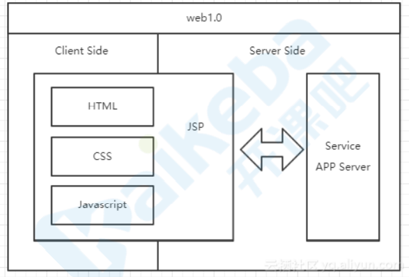

# mvvm

## Web1.0 时代

在 web1.0 时代，并没有前端的概念。开发一个 web 应用多数采用 ASP.NET/Java/PHP 编写，项目通常由多个 aspx/jsp/php 文件构成，每个文件中同时包含了 HTML、CSS、JavaScript、C#/Java/PHP 代码，系统整体架构可能是这样子的：

这种架构的好处是简单快捷，但是，缺点也非常明显：JSP 代码难以维护。为了让开发更加便捷，代码更易维护，前后端职责更清晰。便衍生出 MVC 开发模式和框架，前端展示以模板的形式出现。典型的框架就是 Spring、Structs、Hibernate。整体框架如图所示：

使用这种分层架构，职责清晰，代码易维护。但这里的 MVC 仅限于后端，前后端形成了一定的分离，前端只完成了后端开发中的 view 层。但是，同样的这种模式存在着一些问题：

1. 前端页面开发效率不高。
2. 前后端职责不清

## web2.0 时代

自从 Gmail 的出现，ajax 技术开始风靡全球。有了 ajax 之后，前后端的职责就更加清晰了。因为前端可以通过 Ajax 与后端进行数据交互，因此，整体的架构图也变化成了下面这幅图：

通过 ajax 与后台服务器进行数据交换，前端开发人员，只需要开发页面这部分内容，数据可由后台进行提供。而且 ajax 可以使得页面实现部分刷新，减少了服务端负载和流量消耗，用户体验也更佳。这时， 才开始有专职的前端工程师。同时前端的类库也慢慢的开始发展，最著名的就是 jQuery 了。当然，此架构也存在问题：缺乏可行的开发模式承载更复杂的业务需求，页面内容都杂糅在一起，一旦应用规模增大，就会导致难以维护了。因此，前端的 MVC 也随之而来。

## mvc

* View 传送指令到 Controller
* Controller 完成业务逻辑后，要求 Model 改变状态
* Model 将新的数据发送到 View，用户得到反馈

这样的模型，在理论上是可行的。但往往在实际开发中，并不会这样操作。因为开发过程并不灵活。例如，一个小小的事件操作，都必须经过这样的一个流程，那么开发就不再便捷了。在实际场景中，我们往往会看到另一种模式，如图：

但是，这种灵活可能导致严重的问题：

1. 数据流混乱。
2. View 比较庞大，而 Controller 比较单薄：由于很多的开发者都会在 view 中写一些逻辑代码，逐渐就导致 view 中的内容越来越庞大，而 controller 变得越来越单薄。

## mvp

* 各部分之间的通信，都是双向的。
* View 与 Model 不发生联系，都通过 Presenter 传递。
* View 非常薄，不部署任何业务逻辑，称为"被动视图"（Passive View），即没有任何主动性，而 Presenter非常厚，所有逻辑都部署在那里。

## mvvm

* MVVM 模式将 Presenter 改名为 ViewModel，基本上与 MVP 模式完全一致。
* 唯一的区别是，它采用双向绑定（data-binding）：View的变动，自动反映在 ViewModel，反之亦然。
* ViewModel 通过实现一套数据响应式机制自动响应 Model 中数据变化；同时 ViewModel 会实现一套更新策略自动将数据变化转换为视图更新；通过事件监听响应 View 中用户交互修改 Model 中数据。这样在 ViewModel 中就减少了大量 DOM 操作代码。MVVM 在保持 View 和 Model 松耦合的同时，还减少了维护它们关系的代码，使用户专注于业务逻辑，兼顾开发效率和可维护性。

## 总结

* 这三者都是框架模式，它们设计的目标都是为了解决 Model 和 View 的耦合问题。
* MVC 模式出现较早主要应用在后端，如 Spring MVC、ASP.NET MVC 等，在前端领域的早期也有应用，如 Backbone.js。它的优点是分层清晰，缺点是数据流混乱，灵活性带来的维护性问题。
* MVP 模式在是 MVC 的进化形式，Presenter 作为中间层负责 MV 通信，解决了两者耦合问题，但 P 层过于臃肿会导致维护问题。
* MVVM 模式在前端领域有广泛应用，它不仅解决 MV 耦合问题，还同时解决了维护两者映射关系的大量繁杂代码和 DOM 操作代码，在提高开发效率、可读性同时还保持了优越的性能表现。
