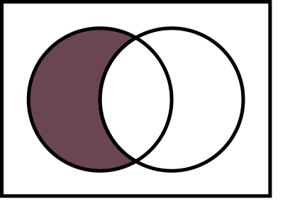

# browserslist

browserslist 是一个配置文件，用于在不同的前端工具直接共享指定目标浏览器或 nodejs 版本的设置。

browserslist 可以放在 package.json 中，或者项目根目录下的 .browserslistrc 文件中。

```js
// package.json
  "browserslist": [
    "defaults",
    "not IE 11",
    "maintained node versions"
  ]

// .browserslistrc
defaults
not IE 11
maintained node versions
```

## 最佳实践

可以设置 browserslist 设置为默认值，适合大多数用户。

```js
  "browserslist": [
    "defaults"
  ]
```

但是更建议用如下设置：

```js
last 2 versions
not dead
> 0.2%
```

## 浏览器数据更新

* 使用 npx browserslist@latest --update-db 命令更新 caniuse-lite 版本。原因是因为如果一直不更新 browserslist 依赖的 caniuse-lite ，假如两年没有更新，那么 last 2 versions 就意味着两年前的浏览器版本。

* 为不同的工具同步 caniuse-lite 的版本。因为有可能 autoprefixer 和 babel 在安装的时候使用的 caniuse-lite 版本不同

## browserslist 设置的几种形式

1. package.json 中 browserslist 字段
2. .browserslistrc 文件
3. browserslist 配置文件
4. BROWSERSLIST 环境变量
5. 如果上面几种形式都不存在，则使用默认设置：> 0.5%, last 2 versions, Firefox ESR, not dead

## 查询（query）

query 的组合，可以使用 or 或者 ,（逗号）。例如： `last 1 version or > 1%` 和 `last 1 version, > 1%` 是同一个意思。还可以使用 and。例如：`last 1 version or chrome > 75 and > 1%`。

|  关键字  |   图例   |  例子  |
|  -----  |  -----  |  -----  |
|  or 或 , 并集  |    |  `> .5% or last 2 versions` <br> `> .5%, last 2 versions`  |
|  and 交集  |    |  `> .5% and last 2 versions`  |
|  not 相对补集  |    |  `> .5% and not last 2 versions` <br> `> .5% or not last 2 versions` <br> `> .5%, not last 2 versions`  |

## 常用 query 写法

* `defaults` 默认值，等价于 `> 0.5%, last 2 versions, Firefox ESR, not dead`
* 使用统计数据
    + `> 5%` 全球使用情况统计选择的浏览器版本。同样可以使用 >=，<，<=
    + `> 5% in US` 美国使用情况统计的浏览器版本。接受两个字母的国家/地区代码
    + `> 5% in alt-AS` 使用亚洲地区使用情况统计。可在以下位置找到[所有地区代码](https://github.com/ben-eb/caniuse-lite/tree/master/data/regions)的列表
    + `> 5% in my stats` 使用[自定义数据](https://github.com/browserslist/browserslist#custom-usage-data)
    + `> 5% in browserslist-config-mycompany stats` 使用来自于 browserslist-config-mycompany/browserslist-stats.json 的自定义数据
    + `cover 99.5%` 提供覆盖的最流行的浏览器
    + `cover 99.5% in US` 和上面的相同，两个字母代表国家/地区
    + `cover 99.5% in my stats` 和上面相同，使用自定义数据
* 最后的版本
    + `last 2 versions` 每种浏览器的最后两个版本
    + `last 2 Chrome versions` chrome 浏览器的最后两个版本
    + `last 2 major versions ` ` last 2 iOS major versions` 最后两个主要版本
* `dead` 官方不再提供更新支持超过 24 个月
* nodejs 版本
    + `node 10` `node 10.4` Node.js 10.x.x 或者 10.4.x 的最后一个发布版本
    + `current node` 当前 browserslist 使用的 nodejs 版本
    + `maintained node versions` 所有 nodejs 版本，官方还[依然维护](https://github.com/nodejs/Release)的版本
* 浏览器版本
    + `iOS 7` iOS 浏览器版本 7
    + `Firefox > 20` 版本号大于 20 的火狐浏览器
    + `ie 6-8` 选择浏览器版本号的一个范围
    + `Firefox ESR` 火狐浏览器 ESR 版本 [Firefox Extended Support Release](https://support.mozilla.org/en-US/kb/choosing-firefox-update-channel)
    + `PhantomJS 2.1` 选择 Safari 版本和 PhantomJS 类似
* `extends browserslist-config-mycompany` 使用 browserslist-config-mycompany 包中的 query
* `supports es6-module` 支持特定功能的浏览器，特定功能的列表看[这里](https://github.com/ben-eb/caniuse-lite/tree/master/data/features)
* `browserslist config` browserslist 配置文件
* `since 2015`  `last 2 years` 根据时间判断的所有版本
* `unreleased versions`  `unreleased Chrome versions` alpha 和 beta 版本
* `not ie <= 8` 除了某种条件之外的版本

## 浏览器名称

* `Android` for Android WebView.
* `Baidu` for Baidu Browser.
* `BlackBerry` or `bb` for Blackberry browser.
* `Chrome` for Google Chrome.
* `ChromeAndroid` or `and_chr` for Chrome for Android
* `Edge` for Microsoft Edge.
* `Electron` for Electron framework. It will be converted to Chrome version.
* `Explorer` or `ie` for Internet Explorer.
* `ExplorerMobile` or `ie_mob` for Internet Explorer Mobile.
* `Firefox` or `ff` for Mozilla Firefox.
* `FirefoxAndroid` or `and_ff` for Firefox for Android.
* `iOS` or `ios_saf` for iOS Safari.
* `Node` for Node.js.
* `Opera` for Opera.
* `OperaMini` or `op_mini` for Opera Mini.
* `OperaMobile` or `op_mob` for Opera Mobile.
* `QQAndroid` or `and_qq` for QQ Browser for Android.
* `Safari` for desktop Safari.
* `Samsung` for Samsung Internet.
* `UCAndroid` or `and_uc` for UC Browser for Android.
* `kaios` for KaiOS Browser.

## 会使用 browserslist 的插件

* `autoprefixer` postcss 的一个插件，用于给 css 添加浏览器引擎前缀
* `Babel` js 编译器
* `postcss-preset-env` 类似 babel，将 css 编译成兼容的形式
* `postcss-normalize` 浏览器都有默认样式。这个插件用于将不同浏览器的默认样式标准化
* `eslint` js 代码错误风格检查
* `stylelint` css 代码错误风格检查

