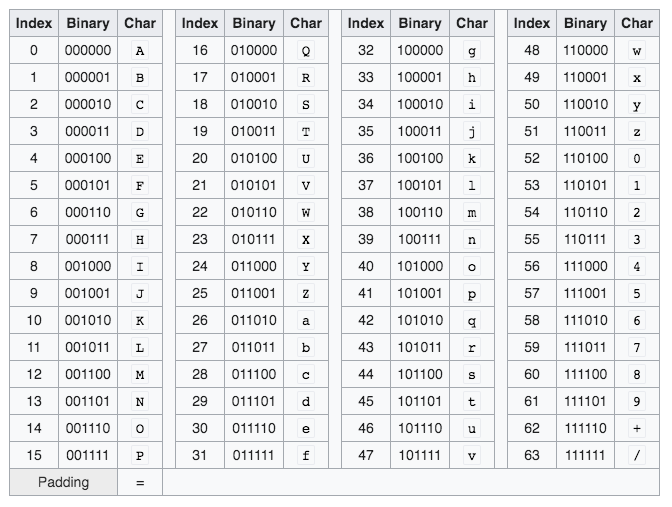

# source-map 原理

## source-map 结构

现在 source-map 规范使用的版本是 v3 版本，格式如下：

```js
{
    "version" : 3, // 规范版本号
    "file": "out.js", // 对应的 bundle 文件
    "sourceRoot": "", // 源文件根目录，这个值会加在每个源文件之前
    "sources": ["foo.js", "bar.js"], // 源文件的文件名组成的数组，bundle 文件是从哪些源文件转换而来的
    "sourcesContent": [null, null], // 与 sources 对应，源文件的源代码字符串
    "names": ["src", "maps", "are", "fun"], // 源文件的变量名和属性名
    "mappings": "A,AAAB;;ABCDE;" // 源文件和 bundle 文件的映射关系
}

```

|  属性  |  含义  |
|  ----  |  ----  |
|  version  |  source-map 使用的规范的版本号  |
|  file  |  source-map 对应的 bundle 文件  |
|  sourceRoot  |  源文件根目录，所有的 sources 中源文件相对的根目录  |
|  sources  |  源文件的文件名组成的数组，bundle 文件是就是从这些源文件转换而来的  |
|  sourcesContent  |  与 sources 对应，源文件的源代码字符串  |
|  names  |  源文件的变量名和属性名  |
|  mappings  |  源文件和 bundle 文件的映射关系  |

## 浏览器加载 source-map 文件流程

1. 根据 webpack 的 devtool 的设置，最终的 source-map 文件大体上可以分为两类
    1. source-map 是一个单独的文件。bundle 文件的最后面会被加上一句注释，例如：`//# sourceMappingURL=bundle.js.map`
    2. source-map 和 bundle 文件合并放在一起被执行。这种情况下，也是在 bundle 的最后面加上了注释，并且注释中 sourceMappingURL 的值是 base64 字符串

浏览器通过读取 sourceMappingURL，拿到对应的 source-map 内容，是一个对象，然后根据这个对象做解析。

2. 浏览器根据 sources 数组生成源码的目录结构，然后根据 sourcesContent 生成对应的源码，这就是为什么在浏览器 Sources 面板中能看到目录结构和源码的原因。

3. 根据 mappings 找到 bundle 中代码对应的源码的位置（文件 => 哪一行 => 哪一列）

## mappings 原理

比如下面这个例子：

```js

// 源码：input.js
i am handsome

// 转换后代码：output.js
i am
handsome

```

源码和 bundle 的映射关系需要 4 个信息：输出位置（output location），源文件（input），源码位置（input location），源码中的字符（character）

如果把上面的例子用这 4 种信息变成表格，则如下显示：


|  output location  |  input  |  input location  |  character  |
|  ----  |  ----  |  ----  |  ----  |
|  L1，C0  |  input.js  |  L1, C0  |  i  |
|  L1，C2  |  input.js  |  L1, C2  |  a  |
|  L1，C3  |  input.js  |  L1, C3  |  m  |
|  L2，C0  |  input.js  |  L1, C5  |  h  |
|  L2，C1  |  input.js  |  L1, C6  |  a  |
|  L2，C2  |  input.js  |  L1, C7  |  n  |
|  L2，C3  |  input.js  |  L1, C8  |  d  |
|  L2，C4  |  input.js  |  L1, C9  |  s  |
|  L2，C5  |  input.js  |  L1, C10  |  o  |
|  L2，C6  |  input.js  |  L1, C11  |  m  |
|  L2，C7  |  input.js  |  L1, C12  |  e  |


可以看到有了这个表格，那么就知道每一个字符在源码和 bundle 中的位置了

## mappings 优化

如果按照上面的方式存储映射关系，信息量太大了，需要优化。优化的方式如下：

1. 把源文件放入数组中，然后只记录一个索引，就不需要每次都用文件名了，因为文件名太长
2. 对于源码，没有必要记录具体每个字符的对应信息，我们只需要记录变量、属性名就可以了（单词），可以使用一个列表来保存单词，位置信息只记录单词首个字符位置即可。
3. 输出文件的行信息是相对重复的，所以可以使用分号来分割每行，使用逗号来分割每个单词的位置信息
4. 源码的每个单词可以使用对于上一个单词的相对位置，这些位置信息（数字）可以更小些。

经过优化，可以将上面的关系表变成如下形式：

```js
sources: [index.js]
names: [i, am, handsome]
```

|  output location  |  sources index（input）  |  input location  |  names index  |
|  ----  |  ----  |  ----  |  ----  |
|  L1，C0  |  0  |  L1, C0  |  0  |
|  L1，C+2  |  + 0  |  L1, C+2  |  + 1  |
|  L2，C-2  |  + 0  |  L1, C+3  |  + 1  |

将上面表格中的信息表示成字符串，如下：

```js
{
    mappings: "0|0|0|0,2|0|2|1;-2|0|3|1"
    // 数字用 | 分隔
    // 0|0|0|0 代表 -> 0(输出单词列), 0(输入文件 sources 索引)，10(输入单词列)，0（单词 names 索引）
}

```

这样可以看到，mappings 的数据少了很多

## 使用 VLQ 进一步优化


VLQ （Variable Length Quantities）是用任意个 2 进制字节组去表示一个任意数字的编码形式。

* 一个组包含 6 个二进制位
* 每组的第一位用来表示是否连续（0 不连续，1 连续）。这个意思是是否这个字节组后面是否还会有另外一个字节组，0 代表当前字节组是最后一个，1 代表当前字节组后面还有另外一个字节组。
* 第一组的最后一位用来表示符号（0 正数，1 负数），其余组最后一位都用来表示数字，因为一个数字只需要一个符号位就可以了。
* 剩余的位置都表示数字

用下面两个例子来说明：

```js
数字：1
二进制：1
VLQ编码：000010
Base64 VLQ: C


数字：-23
绝对值：23
二进制：10111
VLQ编码：101111 000001
Base64 VLQ: vB

/**
第一步：23 的二进制码 -> 10111
第二步：将 10111 分成两部分，第一部分是后四位，第二部分是剩余的最前面一位 -> 1、0111 -> 00001、0111
第三步：按 VLQ 格式拼接 -> 101111 000001
其中，101111是 1【连续标识位】 + 0111 + 1【正负标识位】；000001是 0【连续标识位】+ 00001
第四步：对照 Base64 索引表（下表）

**/
```

下面是 base64 索引表



```js
mappings: "0|0|0|0,2|0|2|1;-2|0|3|1"

0 ——> 0(二进制) ——> 000000(VLQ)
所以 0|0|0|0 变为 000000 000000 000000 000000
转换成 base64 为 AAAA

2 ——> 10(二进制) ——> 000100(VLQ)
0 ——> 0(二进制) ——> 000000(VLQ)
1 ——> 1(二进制) ——> 000010(VLQ)
所以 2|0|2|1 变为 000100 000000 000100 000010
转换成 base64 为 EAEC

-2 ——> -10(二进制)——> 000101(VLQ)
0 ——> 0(二进制) ——> 000000(VLQ)
3 ——> 11(二进制) ——> 000110(VLQ)
1 ——> 1(二进制) ——> 000010(VLQ)
所以 -2|0|3|1 变为 000101 000000 000110 000010
转换成 base64 为 FAGC

mappings: "0|0|0|0,2|0|2|1;-2|0|3|1"
变为
mappings: "AAAA,EAEC;FAGC"
```

