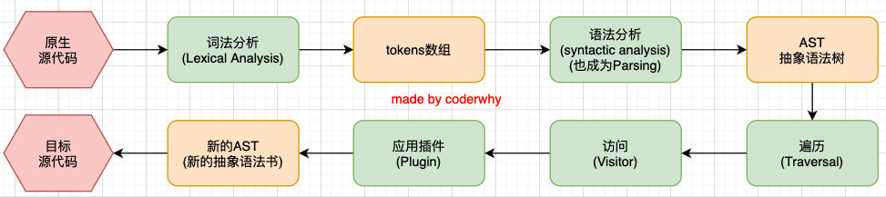

# babel

Babel到底是什么呢？Babel是一个工具链，主要用于旧浏览器或者缓解中将ECMAScript 2015+代码转换为向后兼容版本的JavaScript；包括：语法转换、源代码转换、Polyfill实现目标缓解缺少的功能等；

## Babel命令行使用

* babel本身可以作为一个独立的工具（和postcss一样），不和webpack等构建工具配置来单独使用。如果我们希望在命令行尝试使用babel，需要安装如下库：
    * @babel/core：babel的核心代码，必须安装；
    * @babel/cli：可以让我们在命令行使用babel；

```
npm install @babel/cli @babel/core
```

* 使用babel来处理我们的源代码：
    * src：是源文件的目录；
    * --out-dir：指定要输出的文件夹dist；

```
npx babel src --out-dir dist
```

## 插件的使用

* 比如我们需要转换箭头函数，那么我们就可以使用箭头函数转换相关的插件：

```
npm install @babel/plugin-transform-arrow-functions -D

npx babel src --out-dir dist --plugins=@babel/plugin-transform-arrow-functions
```

* 查看转换后的结果：我们会发现const 并没有转成var
    * 这是因为plugin-transform-arrow-functions，并没有提供这样的功能；
    * 我们需要使用plugin-transform-block-scoping 来完成这样的功能；

```
npm install @babel/plugin-transform-block-scoping -D
npx babel src --out-dir dist --plugins=@babel/plugin-transform-block-scoping,@babel/plugin-transform-arrow-functions
```

## Babel的预设preset

* 但是如果要转换的内容过多，一个个设置是比较麻烦的，我们可以使用预设（preset）：后面我们再具体来讲预设代表的含义；
* 安装@babel/preset-env预设：

```
npm install @babel/preset-env -D
```

* 执行如下命令：

```
npx babel src --out-dir dist --presets=@babel/preset-env
```

## Babel的底层原理

* babel是如何做到将我们的一段代码（ES6、TypeScript、React）转成另外一段代码（ES5）的呢？从一种源代码（原生语言）转换成另一种源代码（目标语言），这是什么的工作呢？就是编译器，事实上我们可以将babel看成就是一个编译器。Babel编译器的作用就是将我们的源代码，转换成浏览器可以直接识别的另外一段源代码；

* Babel也拥有编译器的工作流程：
    * 解析阶段（Parsing）
    * 转换阶段（Transformation）
    * 生成阶段（Code Generation）
    
* https://github.com/jamiebuilds/the-super-tiny-compiler

